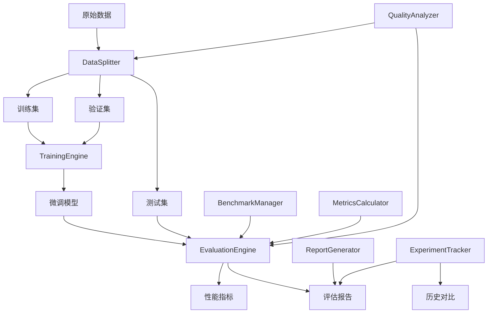
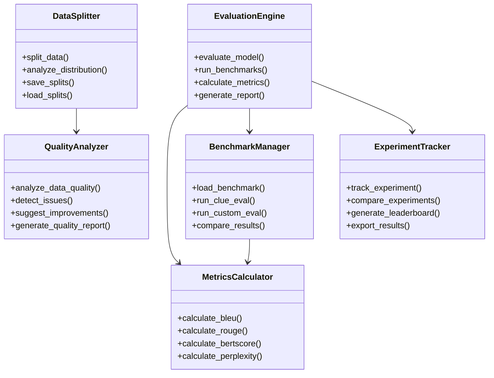

# 设计文档

## 概述

本设计文档描述了为Qwen3优化微调系统添加数据拆分和模型性能评估基准功能的技术实现方案。该功能将与现有的数据处理管道、训练引擎和推理测试器无缝集成，提供科学的数据管理和全面的模型评估能力。

## 架构

### 系统架构图



### 核心组件关系



## 组件和接口

### 1. DataSplitter 组件

**职责**: 科学地拆分训练数据，确保数据分布的一致性和代表性。

**接口设计**:
```python
class DataSplitter:
    def __init__(self, 
                 train_ratio: float = 0.7,
                 val_ratio: float = 0.15, 
                 test_ratio: float = 0.15,
                 stratify_by: Optional[str] = None,
                 random_seed: int = 42):
        pass
    
    def split_data(self, 
                   dataset: Dataset,
                   output_dir: str) -> DataSplitResult:
        """拆分数据集并保存"""
        pass
    
    def analyze_distribution(self, 
                           splits: Dict[str, Dataset]) -> DistributionAnalysis:
        """分析数据分布一致性"""
        pass
    
    def validate_splits(self, 
                       splits: Dict[str, Dataset]) -> ValidationResult:
        """验证拆分质量"""
        pass
```

**核心算法**:
- 分层抽样确保类别平衡
- 统计检验验证分布一致性
- 数据泄露检测和防护

### 2. EvaluationEngine 组件

**职责**: 执行全面的模型性能评估，支持多种评估任务和指标。

**接口设计**:
```python
class EvaluationEngine:
    def __init__(self,
                 model_path: str,
                 base_model_name: str,
                 evaluation_config: EvaluationConfig):
        pass
    
    def evaluate_model(self,
                      test_dataset: Dataset,
                      evaluation_tasks: List[str]) -> EvaluationResult:
        """执行模型评估"""
        pass
    
    def run_benchmark_evaluation(self,
                               benchmark_name: str) -> BenchmarkResult:
        """运行基准测试"""
        pass
    
    def compare_models(self,
                      model_results: List[EvaluationResult]) -> ComparisonResult:
        """对比多个模型"""
        pass
```

**支持的评估任务**:
- 文本生成质量评估 (BLEU, ROUGE, METEOR)
- 语义理解评估 (BERTScore, 语义相似度)
- 问答准确性评估 (EM, F1)
- 分类性能评估 (Accuracy, Precision, Recall)
- 效率评估 (推理速度, 内存占用)

### 3. MetricsCalculator 组件

**职责**: 计算各种标准化的评估指标。

**接口设计**:
```python
class MetricsCalculator:
    @staticmethod
    def calculate_bleu(predictions: List[str], 
                      references: List[str],
                      max_order: int = 4) -> Dict[str, float]:
        """计算BLEU分数"""
        pass
    
    @staticmethod
    def calculate_rouge(predictions: List[str],
                       references: List[str]) -> Dict[str, float]:
        """计算ROUGE分数"""
        pass
    
    @staticmethod
    def calculate_bertscore(predictions: List[str],
                           references: List[str],
                           model_type: str = "bert-base-chinese") -> Dict[str, float]:
        """计算BERTScore"""
        pass
    
    @staticmethod
    def calculate_perplexity(model: Any,
                           tokenizer: Any,
                           texts: List[str]) -> float:
        """计算困惑度"""
        pass
```

### 4. BenchmarkManager 组件

**职责**: 管理和执行标准基准测试。

**接口设计**:
```python
class BenchmarkManager:
    def __init__(self, benchmark_dir: str = "benchmarks"):
        pass
    
    def load_benchmark(self, benchmark_name: str) -> BenchmarkDataset:
        """加载基准数据集"""
        pass
    
    def run_clue_evaluation(self, model: Any, tokenizer: Any) -> CLUEResult:
        """运行CLUE基准测试"""
        pass
    
    def run_custom_benchmark(self, 
                           benchmark_config: BenchmarkConfig) -> BenchmarkResult:
        """运行自定义基准测试"""
        pass
```

**支持的基准数据集**:
- CLUE (中文语言理解评估)
- FewCLUE (少样本学习评估)
- C-Eval (中文知识和推理评估)
- 自定义基准数据集

### 5. QualityAnalyzer 组件

**职责**: 分析数据质量和模型输出质量。

**接口设计**:
```python
class QualityAnalyzer:
    def analyze_data_quality(self, dataset: Dataset) -> DataQualityReport:
        """分析数据质量"""
        pass
    
    def analyze_response_quality(self, 
                               responses: List[str],
                               references: List[str] = None) -> ResponseQualityReport:
        """分析响应质量"""
        pass
    
    def detect_data_issues(self, dataset: Dataset) -> List[DataIssue]:
        """检测数据问题"""
        pass
    
    def suggest_improvements(self, 
                           quality_report: DataQualityReport) -> List[str]:
        """提供改进建议"""
        pass
```

### 6. ExperimentTracker 组件

**职责**: 跟踪和管理实验结果，支持历史对比。

**接口设计**:
```python
class ExperimentTracker:
    def __init__(self, experiment_dir: str = "experiments"):
        pass
    
    def track_experiment(self, 
                        experiment_config: ExperimentConfig,
                        results: EvaluationResult) -> str:
        """记录实验"""
        pass
    
    def compare_experiments(self, 
                          experiment_ids: List[str]) -> ComparisonReport:
        """对比实验结果"""
        pass
    
    def generate_leaderboard(self, 
                           metric: str = "overall_score") -> LeaderboardReport:
        """生成排行榜"""
        pass
    
    def export_results(self, 
                      format: str = "csv") -> str:
        """导出结果"""
        pass
```

## 数据模型

### 核心数据结构

```python
@dataclass
class DataSplitResult:
    """数据拆分结果"""
    train_dataset: Dataset
    val_dataset: Dataset
    test_dataset: Dataset
    split_info: Dict[str, Any]
    distribution_analysis: DistributionAnalysis
    
@dataclass
class EvaluationResult:
    """评估结果"""
    model_name: str
    evaluation_time: datetime
    metrics: Dict[str, float]
    task_results: Dict[str, TaskResult]
    efficiency_metrics: EfficiencyMetrics
    quality_scores: QualityScores
    
@dataclass
class TaskResult:
    """单个任务结果"""
    task_name: str
    predictions: List[str]
    references: List[str]
    metrics: Dict[str, float]
    samples: List[EvaluationSample]
    
@dataclass
class EfficiencyMetrics:
    """效率指标"""
    inference_latency: float  # 平均推理延迟(ms)
    throughput: float  # 吞吐量(tokens/s)
    memory_usage: float  # 内存使用(GB)
    model_size: float  # 模型大小(MB)
    flops: int  # 浮点运算次数
    
@dataclass
class QualityScores:
    """质量分数"""
    fluency: float  # 流畅度
    coherence: float  # 连贯性
    relevance: float  # 相关性
    factuality: float  # 事实性
    overall: float  # 总体质量
```

### 配置数据结构

```python
@dataclass
class EvaluationConfig:
    """评估配置"""
    tasks: List[str]  # 评估任务列表
    metrics: List[str]  # 评估指标列表
    batch_size: int = 8
    max_length: int = 512
    temperature: float = 0.7
    top_p: float = 0.9
    num_samples: int = 100  # 每个任务的样本数
    
@dataclass
class BenchmarkConfig:
    """基准测试配置"""
    name: str
    dataset_path: str
    tasks: List[str]
    evaluation_protocol: str
    metrics: List[str]
```

## 错误处理

### 错误处理策略

1. **数据拆分错误**:
   - 数据不足时的处理策略
   - 分布不均时的重新采样
   - 数据质量问题的自动修复

2. **评估错误**:
   - 模型加载失败的恢复机制
   - 推理超时的处理
   - 内存不足时的批次调整

3. **指标计算错误**:
   - 缺失参考答案的处理
   - 格式不匹配的自动转换
   - 异常值的检测和处理

### 错误恢复机制

```python
class ErrorHandler:
    def handle_split_error(self, error: Exception, dataset: Dataset) -> DataSplitResult:
        """处理数据拆分错误"""
        pass
    
    def handle_evaluation_error(self, error: Exception, task: str) -> TaskResult:
        """处理评估错误"""
        pass
    
    def handle_metric_error(self, error: Exception, metric: str) -> float:
        """处理指标计算错误"""
        pass
```

## 测试策略

### 单元测试

1. **数据拆分测试**:
   - 拆分比例正确性
   - 数据分布一致性
   - 边界条件处理

2. **指标计算测试**:
   - 各种指标的计算准确性
   - 边界值和异常值处理
   - 性能基准测试

3. **评估流程测试**:
   - 端到端评估流程
   - 错误恢复机制
   - 并发安全性

### 集成测试

1. **与现有系统集成**:
   - 数据管道兼容性
   - 训练引擎集成
   - 推理测试器集成

2. **基准测试验证**:
   - 标准数据集结果验证
   - 与已知结果对比
   - 跨平台一致性

### 性能测试

1. **大规模数据处理**:
   - 大数据集拆分性能
   - 内存使用优化
   - 并行处理效率

2. **评估效率测试**:
   - 批量评估性能
   - GPU利用率优化
   - 缓存机制效果

## 部署和集成

### 与现有系统集成

1. **数据管道集成**:
   ```python
   # 在DataPipeline中添加数据拆分功能
   class DataPipeline:
       def __init__(self, ..., enable_split: bool = False):
           if enable_split:
               self.data_splitter = DataSplitter()
   ```

2. **训练引擎集成**:
   ```python
   # 在TrainingEngine中添加验证集评估
   class TrainingEngine:
       def __init__(self, ..., evaluation_config: EvaluationConfig = None):
           if evaluation_config:
               self.evaluation_engine = EvaluationEngine(evaluation_config)
   ```

3. **推理测试器扩展**:
   ```python
   # 扩展InferenceTester支持标准化评估
   class InferenceTester:
       def run_standard_evaluation(self, test_dataset: Dataset) -> EvaluationResult:
           return self.evaluation_engine.evaluate_model(test_dataset)
   ```

### 配置管理

```yaml
# evaluation_config.yaml
data_split:
  train_ratio: 0.7
  val_ratio: 0.15
  test_ratio: 0.15
  stratify_by: "source"
  random_seed: 42

evaluation:
  tasks:
    - "text_generation"
    - "question_answering"
    - "classification"
  
  metrics:
    - "bleu"
    - "rouge"
    - "bertscore"
    - "perplexity"
  
  benchmarks:
    - "clue"
    - "few_clue"
    - "c_eval"
  
  efficiency:
    measure_latency: true
    measure_throughput: true
    measure_memory: true

experiment_tracking:
  enabled: true
  experiment_dir: "./experiments"
  auto_compare: true
  leaderboard_metric: "overall_score"
```

### 命令行接口

```bash
# 数据拆分
python -m src.data_splitter --input data/raw --output data/splits --config split_config.yaml

# 模型评估
python -m src.evaluation_engine --model ./qwen3-finetuned --test-data data/splits/test --config eval_config.yaml

# 基准测试
python -m src.benchmark_manager --model ./qwen3-finetuned --benchmark clue --output results/

# 实验对比
python -m src.experiment_tracker --compare exp1,exp2,exp3 --metric overall_score
```

这个设计提供了一个全面、可扩展的数据拆分和模型评估系统，与现有的Qwen3微调系统无缝集成，支持业界标准的评估方法和指标。