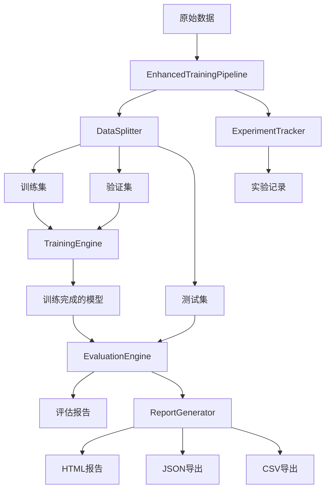
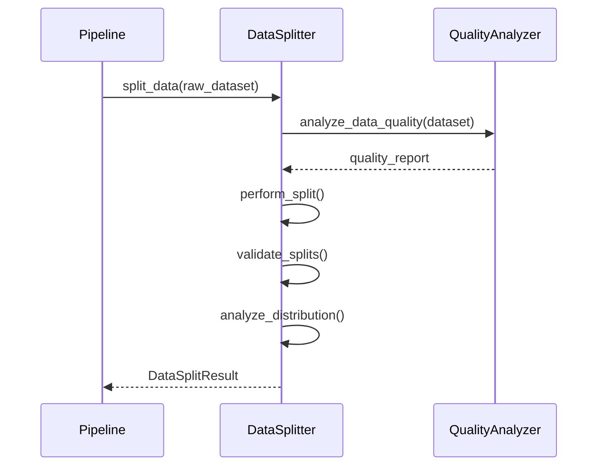
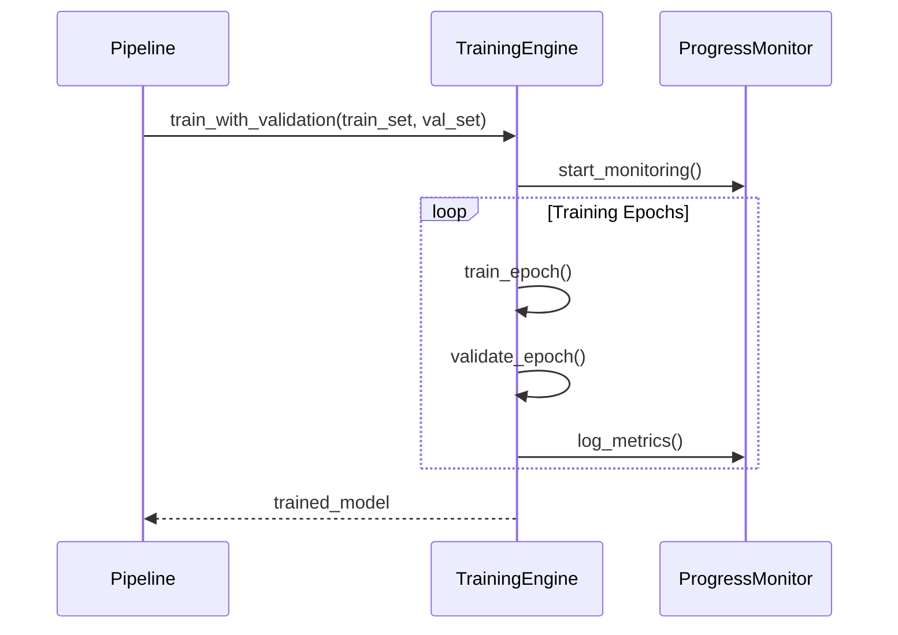
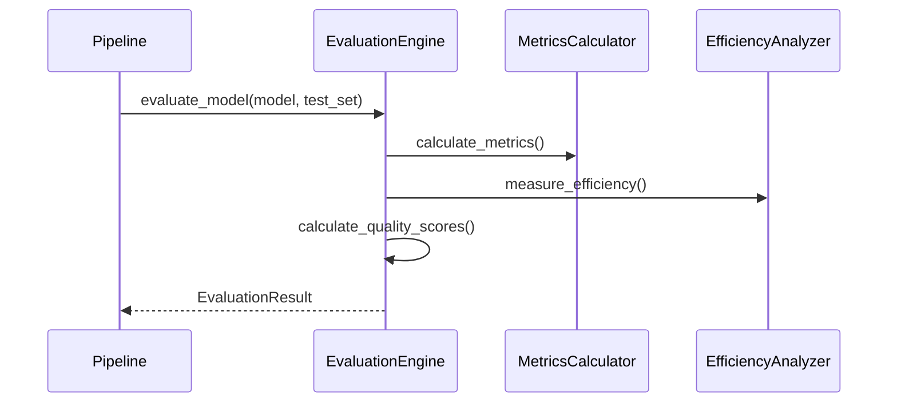

# 设计文档

## 概述

本设计文档描述了增强训练pipeline的架构和实现方案。该系统基于现有的main.py程序，集成数据拆分（DataSplitter）和性能评估（EvaluationEngine）能力，实现从数据准备到模型评估的完整自动化流程。

## 架构

### 系统架构图



### 核心组件

1. **EnhancedTrainingPipeline**: 主协调器，扩展现有的QwenFineTuningApplication
2. **DataSplitter**: 数据拆分器（已存在）
3. **EvaluationEngine**: 评估引擎（已存在）
4. **ExperimentTracker**: 实验跟踪器（已存在）
5. **ReportGenerator**: 报告生成器（已存在）

## 组件和接口

### EnhancedTrainingPipeline

扩展现有的`QwenFineTuningApplication`类，添加数据拆分和评估功能。

```python
class EnhancedTrainingPipeline(QwenFineTuningApplication):
    def __init__(self, config: EnhancedApplicationConfig):
        super().__init__(config)
        self.data_splitter = None
        self.evaluation_engine = None
        self.experiment_tracker = None
        self.report_generator = None
        
    def run_enhanced_pipeline(self) -> EnhancedPipelineResult:
        # 1. 数据拆分
        # 2. 模型训练
        # 3. 模型评估
        # 4. 报告生成
        # 5. 实验记录
```

### EnhancedApplicationConfig

扩展现有的`ApplicationConfig`，添加数据拆分和评估相关配置。

```python
@dataclass
class EnhancedApplicationConfig(ApplicationConfig):
    # 数据拆分配置
    enable_data_splitting: bool = True
    train_ratio: float = 0.7
    val_ratio: float = 0.15
    test_ratio: float = 0.15
    stratify_by: Optional[str] = None
    data_split_seed: int = 42
    
    # 评估配置
    enable_comprehensive_evaluation: bool = True
    evaluation_tasks: List[str] = field(default_factory=lambda: ["text_generation"])
    evaluation_metrics: List[str] = field(default_factory=lambda: ["bleu", "rouge", "accuracy"])
    enable_efficiency_metrics: bool = True
    enable_quality_analysis: bool = True
    
    # 基准测试配置
    enable_benchmark_testing: bool = False
    benchmark_datasets: List[str] = field(default_factory=list)
    baseline_model_path: Optional[str] = None
    
    # 实验跟踪配置
    enable_experiment_tracking: bool = True
    experiment_name: Optional[str] = None
    experiment_tags: List[str] = field(default_factory=list)
    
    # 报告配置
    report_formats: List[str] = field(default_factory=lambda: ["html", "json"])
    enable_visualization: bool = True
    output_charts: bool = True
```

### 数据模型

#### EnhancedPipelineResult

```python
@dataclass
class EnhancedPipelineResult:
    # 数据拆分结果
    data_split_result: DataSplitResult
    
    # 训练结果
    training_result: Dict[str, Any]
    
    # 评估结果
    evaluation_result: EvaluationResult
    
    # 基准测试结果（可选）
    benchmark_results: Optional[List[BenchmarkResult]] = None
    
    # 实验记录ID
    experiment_id: Optional[str] = None
    
    # 报告路径
    report_paths: Dict[str, str] = field(default_factory=dict)
    
    # 执行统计
    execution_stats: Dict[str, Any] = field(default_factory=dict)
```

#### TrainingValidationMetrics

```python
@dataclass
class TrainingValidationMetrics:
    epoch: int
    train_loss: float
    val_loss: float
    val_metrics: Dict[str, float]
    timestamp: datetime
```

## 数据流

### 1. 数据拆分阶段



### 2. 训练阶段



### 3. 评估阶段



## 错误处理

### 错误类型和处理策略

1. **数据拆分错误**
   - 数据量不足：提供警告并调整拆分比例
   - 分层失败：回退到随机拆分
   - 质量问题：生成警告报告但继续执行

2. **训练错误**
   - 内存不足：自动调整批次大小
   - 验证集评估失败：记录警告但继续训练
   - 早停触发：正常结束并保存模型

3. **评估错误**
   - 推理失败：记录失败样本并继续
   - 指标计算错误：使用默认值并记录警告
   - 效率测量失败：跳过效率指标

### 恢复机制

```python
class ErrorRecoveryManager:
    def handle_data_split_error(self, error: Exception) -> DataSplitResult:
        # 实现数据拆分错误恢复
        pass
    
    def handle_training_error(self, error: Exception) -> bool:
        # 实现训练错误恢复
        pass
    
    def handle_evaluation_error(self, error: Exception) -> EvaluationResult:
        # 实现评估错误恢复
        pass
```

## 测试策略

### 单元测试

1. **数据拆分测试**
   - 测试不同拆分比例
   - 测试分层抽样功能
   - 测试数据质量分析

2. **训练集成测试**
   - 测试训练流程集成
   - 测试验证集评估
   - 测试早停机制

3. **评估功能测试**
   - 测试多种评估指标
   - 测试效率分析
   - 测试报告生成

### 集成测试

1. **端到端测试**
   - 完整pipeline测试
   - 不同配置组合测试
   - 错误恢复测试

2. **性能测试**
   - 大数据集处理测试
   - 内存使用测试
   - 并发处理测试

### 测试数据

```python
# 测试配置
TEST_CONFIG = EnhancedApplicationConfig(
    model_name="test_model",
    data_dir="test_data",
    enable_data_splitting=True,
    train_ratio=0.6,
    val_ratio=0.2,
    test_ratio=0.2,
    enable_comprehensive_evaluation=True,
    num_epochs=1,  # 快速测试
    batch_size=2
)
```

## 性能优化

### 内存优化

1. **数据加载优化**
   - 使用数据流式加载
   - 实现数据缓存机制
   - 优化数据预处理

2. **模型优化**
   - 继承现有的内存优化策略
   - 实现梯度检查点
   - 优化推理内存使用

### 计算优化

1. **并行处理**
   - 数据预处理并行化
   - 评估批次并行化
   - 报告生成并行化

2. **缓存策略**
   - 缓存数据拆分结果
   - 缓存评估中间结果
   - 缓存报告模板

## 配置管理

### 配置文件结构

```yaml
# enhanced_config.yaml
model:
  name: "Qwen/Qwen3-4B-Thinking-2507"
  output_dir: "./enhanced-qwen3-finetuned"

data:
  data_dir: "data/raw"
  enable_splitting: true
  train_ratio: 0.7
  val_ratio: 0.15
  test_ratio: 0.15
  stratify_by: null
  split_seed: 42

training:
  batch_size: 4
  num_epochs: 5
  learning_rate: 5e-5
  enable_validation: true

evaluation:
  enable_comprehensive: true
  tasks: ["text_generation"]
  metrics: ["bleu", "rouge", "accuracy"]
  enable_efficiency: true
  enable_quality: true

experiment:
  enable_tracking: true
  name: "enhanced_pipeline_experiment"
  tags: ["qwen3", "enhanced", "full_pipeline"]

reports:
  formats: ["html", "json", "csv"]
  enable_visualization: true
  output_charts: true
```

### 配置验证

```python
class ConfigValidator:
    def validate_enhanced_config(self, config: EnhancedApplicationConfig) -> List[str]:
        errors = []
        
        # 验证拆分比例
        if abs(config.train_ratio + config.val_ratio + config.test_ratio - 1.0) > 1e-6:
            errors.append("拆分比例之和必须为1.0")
        
        # 验证评估配置
        if config.enable_comprehensive_evaluation and not config.evaluation_tasks:
            errors.append("启用评估时必须指定评估任务")
        
        return errors
```

## 监控和日志

### 日志结构

```python
# 扩展现有的日志系统
class EnhancedLoggingSystem(LoggingSystem):
    def log_data_split_info(self, split_result: DataSplitResult):
        # 记录数据拆分信息
        pass
    
    def log_evaluation_progress(self, progress: Dict[str, Any]):
        # 记录评估进度
        pass
    
    def log_experiment_info(self, experiment_id: str, config: EnhancedApplicationConfig):
        # 记录实验信息
        pass
```

### 监控指标

1. **数据拆分监控**
   - 拆分时间
   - 数据质量分数
   - 分布一致性分数

2. **训练监控**
   - 训练损失曲线
   - 验证指标曲线
   - 内存使用情况

3. **评估监控**
   - 评估进度
   - 指标计算时间
   - 推理性能

## 部署和维护

### 部署要求

1. **环境依赖**
   - 继承现有环境要求
   - 添加评估相关依赖
   - 支持可选的可视化依赖

2. **资源要求**
   - 内存：建议16GB以上
   - 存储：额外需要数据拆分和报告存储空间
   - GPU：支持训练和评估的GPU资源

### 维护策略

1. **版本管理**
   - 向后兼容现有配置
   - 渐进式功能升级
   - 配置迁移工具

2. **监控和告警**
   - 实验失败告警
   - 资源使用监控
   - 性能回归检测