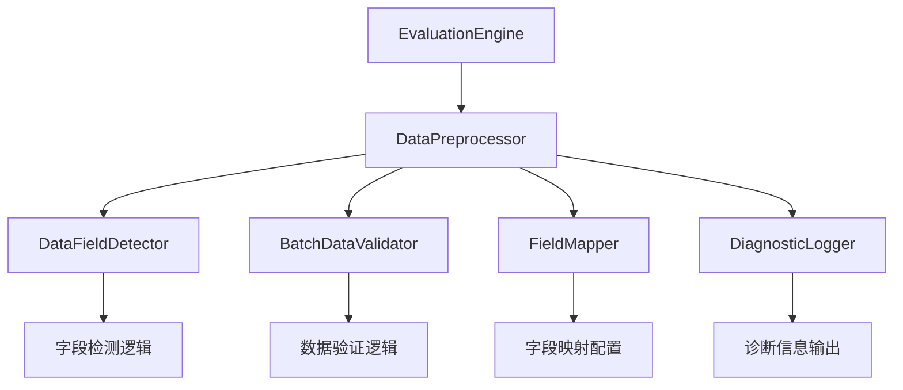

# 设计文档

## 概述

本设计文档描述了修复评估引擎批次数据处理问题的技术方案。当前问题的根本原因是`_prepare_inputs`方法无法正确识别和提取批次数据中的有效字段，导致所有批次被标记为空并跳过。解决方案包括增强数据字段检测、改进错误处理、添加数据验证和提供灵活的字段映射机制。

## 架构

### 核心组件

1. **DataFieldDetector**: 智能数据字段检测器
2. **BatchDataValidator**: 批次数据验证器  
3. **FieldMapper**: 可配置字段映射器
4. **DataPreprocessor**: 数据预处理器
5. **DiagnosticLogger**: 诊断日志记录器

### 组件关系



## 组件和接口

### DataFieldDetector

负责智能检测批次数据中的有效字段。

```python
class DataFieldDetector:
    def detect_input_fields(self, batch: Dict[str, List], task_name: str) -> List[str]
    def get_field_priority(self, task_name: str) -> List[str]
    def analyze_batch_structure(self, batch: Dict[str, List]) -> Dict[str, Any]
```

**主要功能:**
- 根据任务类型确定字段优先级
- 检测可用的输入字段
- 分析批次数据结构

### BatchDataValidator

验证批次数据的完整性和有效性。

```python
class BatchDataValidator:
    def validate_batch(self, batch: Dict[str, List]) -> ValidationResult
    def check_field_consistency(self, batch: Dict[str, List]) -> bool
    def get_valid_samples_count(self, batch: Dict[str, List], field_name: str) -> int
```

**主要功能:**
- 验证批次数据结构
- 检查字段一致性
- 统计有效样本数量

### FieldMapper

提供灵活的字段映射机制。

```python
class FieldMapper:
    def __init__(self, mapping_config: Optional[Dict[str, str]] = None)
    def map_fields(self, batch: Dict[str, List], task_name: str) -> Dict[str, List]
    def get_mapped_field_name(self, original_name: str, task_name: str) -> str
```

**主要功能:**
- 支持自定义字段映射
- 根据任务类型应用映射规则
- 提供默认映射回退机制

### DataPreprocessor

统一的数据预处理入口。

```python
class DataPreprocessor:
    def __init__(self, config: EvaluationConfig)
    def prepare_inputs(self, batch: Dict[str, List], task_name: str) -> List[str]
    def preprocess_batch(self, batch: Dict[str, List], task_name: str) -> ProcessedBatch
```

**主要功能:**
- 整合所有数据处理组件
- 提供统一的预处理接口
- 处理异常和错误恢复

## 数据模型

### ValidationResult

```python
@dataclass
class ValidationResult:
    is_valid: bool
    valid_samples_count: int
    total_samples_count: int
    available_fields: List[str]
    issues: List[str]
    suggestions: List[str]
```

### ProcessedBatch

```python
@dataclass
class ProcessedBatch:
    inputs: List[str]
    valid_indices: List[int]
    skipped_indices: List[int]
    processing_stats: Dict[str, Any]
    warnings: List[str]
```

### FieldDetectionResult

```python
@dataclass
class FieldDetectionResult:
    detected_fields: List[str]
    recommended_field: Optional[str]
    field_analysis: Dict[str, Dict[str, Any]]
    confidence_scores: Dict[str, float]
```

## 错误处理

### 错误分类

1. **数据结构错误**: 批次数据格式不正确
2. **字段缺失错误**: 预期字段不存在
3. **数据类型错误**: 字段数据类型不匹配
4. **数据为空错误**: 字段存在但数据为空

### 错误处理策略

```python
class ErrorHandlingStrategy:
    def handle_empty_batch(self, batch: Dict[str, List]) -> List[str]
    def handle_missing_fields(self, batch: Dict[str, List], task_name: str) -> List[str]
    def handle_invalid_data_types(self, batch: Dict[str, List], field_name: str) -> List[str]
    def handle_partial_data(self, batch: Dict[str, List], field_name: str) -> List[str]
```

### 降级处理机制

1. **字段回退**: 主字段不可用时尝试备选字段
2. **数据清理**: 自动清理无效数据
3. **默认值填充**: 为缺失数据提供默认值
4. **跳过策略**: 智能跳过无效样本

## 测试策略

### 单元测试

1. **DataFieldDetector测试**
   - 测试不同数据格式的字段检测
   - 测试任务特定的字段优先级
   - 测试边界情况处理

2. **BatchDataValidator测试**
   - 测试数据验证逻辑
   - 测试一致性检查
   - 测试统计功能

3. **FieldMapper测试**
   - 测试自定义映射配置
   - 测试默认映射逻辑
   - 测试映射回退机制

### 集成测试

1. **端到端批次处理测试**
   - 使用真实数据集测试完整流程
   - 测试不同任务类型的处理
   - 测试错误恢复机制

2. **性能测试**
   - 测试大批次数据处理性能
   - 测试内存使用效率
   - 测试并发处理能力

### 回归测试

1. **现有功能兼容性测试**
   - 确保修复不影响现有评估功能
   - 测试向后兼容性
   - 验证配置文件兼容性

## 配置扩展

### 新增配置选项

```yaml
evaluation:
  data_processing:
    field_mapping:
      text_generation:
        input_fields: ["text", "input", "prompt"]
        target_fields: ["target", "answer", "output"]
      question_answering:
        input_fields: ["question", "query"]
        context_fields: ["context", "passage"]
        target_fields: ["answer", "target"]
    
    validation:
      min_valid_samples_ratio: 0.1
      skip_empty_batches: true
      enable_data_cleaning: true
    
    diagnostics:
      enable_detailed_logging: false
      log_batch_statistics: true
      save_processing_report: true
```

### 配置验证

```python
class ConfigValidator:
    def validate_field_mapping_config(self, config: Dict) -> bool
    def validate_processing_config(self, config: Dict) -> bool
    def get_default_config(self) -> Dict
```

## 监控和日志

### 诊断信息

1. **批次处理统计**
   - 处理的批次数量
   - 有效样本数量
   - 跳过的样本数量
   - 处理时间统计

2. **数据质量指标**
   - 字段覆盖率
   - 数据完整性评分
   - 异常数据比例

3. **性能指标**
   - 批次处理延迟
   - 内存使用峰值
   - 错误恢复次数

### 日志级别

- **DEBUG**: 详细的批次处理信息
- **INFO**: 处理统计和进度信息  
- **WARNING**: 数据质量问题和降级处理
- **ERROR**: 严重错误和处理失败

## 部署考虑

### 向后兼容性

- 保持现有API接口不变
- 新功能通过配置选项控制
- 提供迁移指南和最佳实践

### 性能影响

- 新增的验证和检测逻辑设计为轻量级
- 支持禁用详细诊断以优化性能
- 使用缓存机制避免重复计算

### 扩展性

- 组件化设计支持独立扩展
- 插件机制支持自定义处理逻辑
- 配置驱动的行为定制