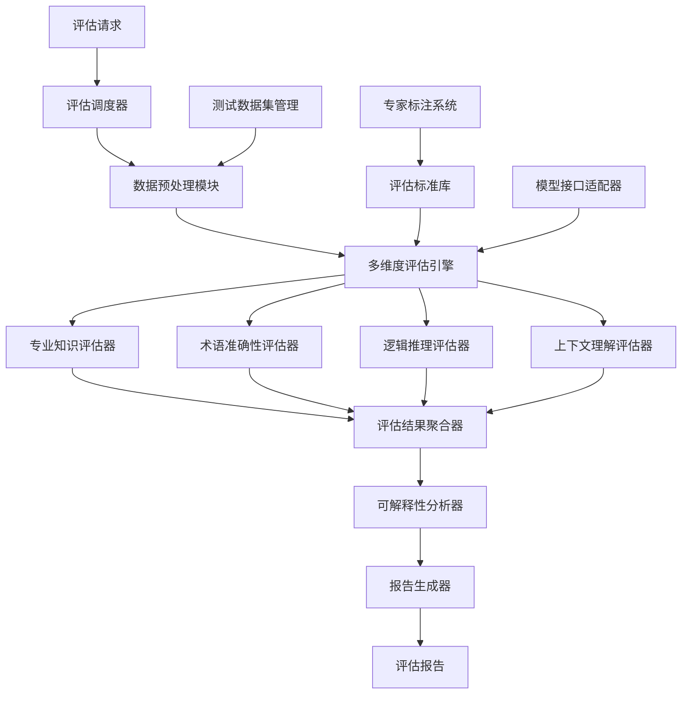

# 设计文档

## 概述

行业化模型评估系统是一个综合性的评估框架，旨在为基座模型的行业微调提供可靠、有效、公允的评估方法。系统采用多维度评估指标体系，结合自动化评估引擎和专家标注系统，提供比传统BLEU、ROUGE更适合行业场景的评估能力。

## 架构

### 系统架构图



### 核心组件

1. **评估调度器**：负责任务调度和资源管理
2. **多维度评估引擎**：核心评估逻辑实现
3. **专家标注系统**：支持行业专家参与评估标准制定
4. **可解释性分析器**：提供详细的评估结果分析

## 组件和接口

### 评估引擎接口

```python
class EvaluationEngine:
    def evaluate_model(self, model_id: str, dataset: Dataset, 
                      evaluation_config: EvaluationConfig) -> EvaluationResult
    def get_evaluation_progress(self, task_id: str) -> ProgressInfo
    def generate_report(self, evaluation_result: EvaluationResult) -> Report
```

### 评估器接口

```python
class BaseEvaluator:
    def evaluate(self, input_text: str, model_output: str, 
                expected_output: str, context: Dict) -> EvaluationScore
    def get_evaluation_criteria(self) -> List[Criterion]
    def explain_result(self, score: EvaluationScore) -> Explanation
```

### 专业知识评估器

- **知识图谱匹配**：基于行业知识图谱验证模型输出的专业概念
- **事实一致性检查**：验证模型生成内容与行业标准知识的一致性
- **概念关系验证**：检查专业概念之间关系的正确性

### 术语准确性评估器

- **术语识别**：自动识别行业专业术语
- **术语使用评估**：评估术语在特定上下文中的使用正确性
- **术语一致性检查**：确保术语使用的前后一致性

### 逻辑推理评估器

- **因果关系推理**：评估模型对行业因果关系的理解
- **多步推理能力**：测试复杂业务场景下的推理能力
- **假设验证**：评估模型对业务假设的验证能力

### 上下文理解评估器

- **长文本理解**：评估对长篇行业文档的理解能力
- **多轮对话理解**：测试在业务对话中的上下文保持能力
- **隐含信息提取**：评估对行业文本隐含信息的理解

## 数据模型

### 评估配置模型

```python
@dataclass
class EvaluationConfig:
    industry_domain: str  # 行业领域
    evaluation_dimensions: List[str]  # 评估维度
    weight_config: Dict[str, float]  # 各维度权重
    threshold_config: Dict[str, float]  # 阈值配置
    expert_review_required: bool  # 是否需要专家复核
```

### 评估结果模型

```python
@dataclass
class EvaluationResult:
    overall_score: float  # 综合评分
    dimension_scores: Dict[str, float]  # 各维度得分
    detailed_results: List[SampleResult]  # 详细结果
    error_analysis: ErrorAnalysis  # 错误分析
    improvement_suggestions: List[str]  # 改进建议
```

### 样本结果模型

```python
@dataclass
class SampleResult:
    sample_id: str
    input_text: str
    model_output: str
    expected_output: str
    dimension_scores: Dict[str, float]
    error_types: List[str]
    explanation: str
```

## 错误处理

### 评估异常处理

1. **模型接口异常**：
   - 超时处理：设置合理的超时时间，超时后记录并跳过
   - 连接异常：实现重试机制，最多重试3次
   - 响应格式异常：记录异常样本，继续处理其他样本

2. **数据异常处理**：
   - 数据格式错误：验证数据格式，提供详细错误信息
   - 缺失数据：标记缺失字段，使用默认值或跳过处理
   - 数据编码问题：自动检测和转换编码格式

3. **评估器异常**：
   - 评估器初始化失败：记录错误并使用备用评估器
   - 评估过程异常：捕获异常，记录详细错误信息
   - 资源不足：实现优雅降级，减少并发评估任务

### 容错机制

- **部分评估结果**：即使某些维度评估失败，也能提供其他维度的结果
- **评估质量监控**：监控评估器的稳定性和准确性
- **自动恢复**：支持从中断点恢复评估任务

## 测试策略

### 单元测试

1. **评估器测试**：
   - 测试各个评估器的核心逻辑
   - 验证评估结果的准确性和一致性
   - 测试边界条件和异常情况

2. **数据处理测试**：
   - 测试数据预处理逻辑
   - 验证数据格式转换的正确性
   - 测试大数据量处理的性能

### 集成测试

1. **端到端评估流程测试**：
   - 测试完整的评估流程
   - 验证各组件之间的协作
   - 测试并发评估的稳定性

2. **模型接口集成测试**：
   - 测试与不同模型接口的集成
   - 验证接口适配器的兼容性
   - 测试异常情况下的处理

### 性能测试

1. **评估性能测试**：
   - 测试大规模数据集的评估性能
   - 验证系统的并发处理能力
   - 测试内存和CPU使用情况

2. **准确性验证测试**：
   - 与人工评估结果对比验证
   - 测试评估结果的稳定性和可重复性
   - 验证不同行业领域的适用性

### 用户验收测试

1. **专家评估验证**：
   - 邀请行业专家验证评估结果
   - 收集专家对评估标准的反馈
   - 验证评估报告的可理解性

2. **实际场景测试**：
   - 在真实的微调项目中测试系统
   - 验证评估结果对模型改进的指导价值
   - 测试系统的易用性和稳定性