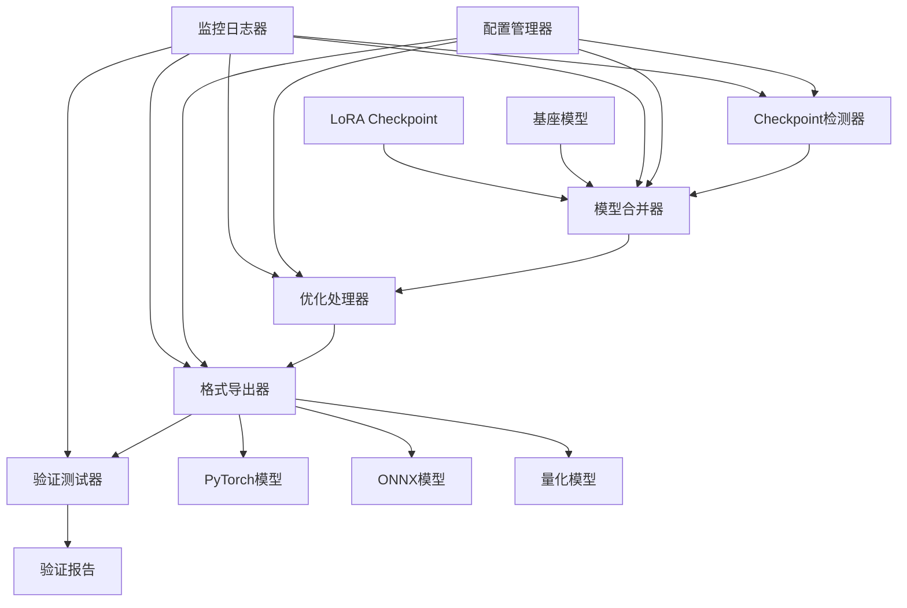

# 设计文档

## 概述

模型导出优化系统将提供一个完整的解决方案，用于将训练完成的LoRA checkpoint与基座模型合并，并导出为多种优化格式。系统设计采用模块化架构，支持灵活的配置和多种导出策略，确保在不同部署场景下的最佳性能。

## 架构

### 系统架构图



### 核心组件

1. **CheckpointDetector**: 自动检测和验证训练完成的checkpoint
2. **ModelMerger**: 将LoRA适配器与基座模型合并
3. **OptimizationProcessor**: 应用各种优化策略（量化、压缩等）
4. **FormatExporter**: 导出多种格式的模型
5. **ValidationTester**: 验证导出模型的功能性和一致性
6. **ConfigurationManager**: 管理导出配置和参数
7. **MonitoringLogger**: 提供过程监控和日志记录

## 组件和接口

### 1. CheckpointDetector

```python
class CheckpointDetector:
    """检测和验证训练checkpoint的组件"""
    
    def detect_latest_checkpoint(self, checkpoint_dir: str) -> str
    def validate_checkpoint_integrity(self, checkpoint_path: str) -> bool
    def get_checkpoint_metadata(self, checkpoint_path: str) -> dict
    def list_available_checkpoints(self, checkpoint_dir: str) -> List[str]
```

**职责**:
- 自动识别最新的checkpoint目录
- 验证checkpoint文件的完整性
- 提取checkpoint元数据信息
- 支持手动选择特定checkpoint

### 2. ModelMerger

```python
class ModelMerger:
    """合并LoRA适配器与基座模型的组件"""
    
    def load_base_model(self, model_name: str) -> AutoModelForCausalLM
    def load_lora_adapter(self, adapter_path: str) -> PeftModel
    def merge_lora_weights(self, base_model: AutoModelForCausalLM, 
                          adapter_path: str) -> AutoModelForCausalLM
    def save_merged_model(self, model: AutoModelForCausalLM, 
                         output_path: str) -> None
    def verify_merge_integrity(self, merged_model: AutoModelForCausalLM) -> bool
```

**职责**:
- 加载基座模型（支持量化和非量化）
- 加载LoRA适配器权重
- 执行权重合并操作
- 保存合并后的完整模型
- 验证合并结果的正确性

### 3. OptimizationProcessor

```python
class OptimizationProcessor:
    """模型优化处理组件"""
    
    def apply_quantization(self, model: AutoModelForCausalLM, 
                          quant_config: QuantizationConfig) -> AutoModelForCausalLM
    def compress_model_weights(self, model: AutoModelForCausalLM) -> AutoModelForCausalLM
    def remove_training_artifacts(self, model: AutoModelForCausalLM) -> AutoModelForCausalLM
    def optimize_model_structure(self, model: AutoModelForCausalLM) -> AutoModelForCausalLM
    def calculate_size_reduction(self, original_size: int, 
                               optimized_size: int) -> dict
```

**职责**:
- 应用不同级别的量化（int8, int4, fp16）
- 移除训练时的冗余参数和元数据
- 优化模型结构以减少内存占用
- 计算和报告优化效果

### 4. FormatExporter

```python
class FormatExporter:
    """多格式模型导出组件"""
    
    def export_pytorch_model(self, model: AutoModelForCausalLM, 
                           output_path: str) -> str
    def export_onnx_model(self, model: AutoModelForCausalLM, 
                         tokenizer: AutoTokenizer, 
                         output_path: str, 
                         onnx_config: ONNXConfig) -> str
    def export_tensorrt_model(self, onnx_path: str, 
                            output_path: str) -> str
    def optimize_onnx_graph(self, onnx_path: str) -> str
    def validate_onnx_export(self, original_model: AutoModelForCausalLM,
                           onnx_path: str) -> bool
```

**职责**:
- 导出标准PyTorch格式模型
- 转换为ONNX格式并优化计算图
- 支持TensorRT等推理引擎格式
- 验证不同格式模型的一致性

### 5. ValidationTester

```python
class ValidationTester:
    """模型验证测试组件"""
    
    def test_model_functionality(self, model_path: str, 
                               test_inputs: List[str]) -> dict
    def compare_model_outputs(self, model1_path: str, 
                            model2_path: str, 
                            test_inputs: List[str]) -> dict
    def benchmark_inference_speed(self, model_path: str, 
                                test_inputs: List[str]) -> dict
    def measure_memory_usage(self, model_path: str) -> dict
    def generate_validation_report(self, test_results: dict) -> str
```

**职责**:
- 测试导出模型的基本功能
- 比较不同格式模型的输出一致性
- 性能基准测试（推理速度、内存使用）
- 生成详细的验证报告

## 数据模型

### ExportConfiguration

```python
@dataclass
class ExportConfiguration:
    """导出配置数据模型"""
    
    # 基本配置
    checkpoint_path: str
    base_model_name: str
    output_directory: str
    
    # 优化配置
    quantization_level: str = "int8"  # "none", "fp16", "int8", "int4"
    remove_training_artifacts: bool = True
    compress_weights: bool = True
    
    # 导出格式
    export_pytorch: bool = True
    export_onnx: bool = True
    export_tensorrt: bool = False
    
    # ONNX配置
    onnx_dynamic_axes: dict = None
    onnx_opset_version: int = 14
    onnx_optimize_graph: bool = True
    
    # 验证配置
    run_validation_tests: bool = True
    test_input_samples: List[str] = None
    
    # 监控配置
    enable_progress_monitoring: bool = True
    log_level: str = "INFO"
```

### ExportResult

```python
@dataclass
class ExportResult:
    """导出结果数据模型"""
    
    # 基本信息
    export_id: str
    timestamp: datetime
    success: bool
    
    # 输出路径
    pytorch_model_path: Optional[str] = None
    onnx_model_path: Optional[str] = None
    tensorrt_model_path: Optional[str] = None
    
    # 优化统计
    original_size_mb: float
    optimized_size_mb: float
    size_reduction_percentage: float
    
    # 性能指标
    inference_speed_ms: Optional[float] = None
    memory_usage_mb: Optional[float] = None
    
    # 验证结果
    validation_passed: bool = False
    validation_report_path: Optional[str] = None
    
    # 错误信息
    error_message: Optional[str] = None
    warnings: List[str] = field(default_factory=list)
```

## 错误处理

### 错误分类和处理策略

1. **Checkpoint错误**
   - 文件不存在或损坏
   - 格式不兼容
   - 元数据缺失
   - 处理策略：提供详细错误信息，建议修复方法

2. **模型合并错误**
   - 基座模型加载失败
   - LoRA适配器不兼容
   - 内存不足
   - 处理策略：自动重试，降级处理，内存优化

3. **导出格式错误**
   - ONNX转换失败
   - 不支持的操作符
   - 动态形状问题
   - 处理策略：回退到兼容配置，提供替代方案

4. **验证失败**
   - 输出不一致
   - 性能下降过多
   - 功能性测试失败
   - 处理策略：生成详细报告，提供调优建议

### 异常处理机制

```python
class ModelExportException(Exception):
    """模型导出相关异常的基类"""
    pass

class CheckpointValidationError(ModelExportException):
    """Checkpoint验证错误"""
    pass

class ModelMergeError(ModelExportException):
    """模型合并错误"""
    pass

class FormatExportError(ModelExportException):
    """格式导出错误"""
    pass

class ValidationError(ModelExportException):
    """验证测试错误"""
    pass

class ONNXExportError(FormatExportError):
    """ONNX导出特定错误"""
    pass

class TracerWarningError(ONNXExportError):
    """PyTorch Tracer警告相关错误"""
    pass

class UnorderedMapError(ONNXExportError):
    """unordered_map相关的ONNX导出错误"""
    pass
```

### ONNX导出错误恢复策略

#### 1. unordered_map错误处理

```python
class ONNXErrorRecovery:
    """ONNX导出错误恢复处理器"""
    
    def handle_unordered_map_error(self, error_msg: str, config: ExportConfiguration) -> List[RecoveryStrategy]:
        """处理invalid unordered_map<K, T> key错误"""
        strategies = [
            # 策略1: 禁用动态轴
            RecoveryStrategy(
                name="禁用动态轴",
                action=lambda: self._disable_dynamic_axes(config),
                priority=1
            ),
            # 策略2: 降低opset版本
            RecoveryStrategy(
                name="降低ONNX opset版本",
                action=lambda: self._downgrade_opset_version(config),
                priority=2
            ),
            # 策略3: 简化输出配置
            RecoveryStrategy(
                name="简化输出配置",
                action=lambda: self._simplify_output_config(config),
                priority=3
            ),
            # 策略4: 使用CPU导出
            RecoveryStrategy(
                name="强制CPU导出",
                action=lambda: self._force_cpu_export(config),
                priority=4
            )
        ]
        return strategies
    
    def handle_tracer_warnings(self, warnings: List[str], model: AutoModelForCausalLM) -> AutoModelForCausalLM:
        """处理PyTorch Tracer警告"""
        # 识别masking相关警告
        if any("masking_utils" in w for w in warnings):
            return self._fix_masking_issues(model)
        
        # 识别控制流警告
        if any("Converting a tensor to a Python boolean" in w for w in warnings):
            return self._fix_control_flow_issues(model)
        
        return model
```

#### 2. Qwen3模型特殊处理

```python
class Qwen3ONNXAdapter:
    """Qwen3模型ONNX导出适配器"""
    
    def adapt_for_onnx_export(self, model: AutoModelForCausalLM) -> AutoModelForCausalLM:
        """为ONNX导出适配Qwen3模型"""
        
        # 1. 修复attention mask处理
        model = self._fix_attention_masking(model)
        
        # 2. 简化动态形状逻辑
        model = self._simplify_dynamic_shapes(model)
        
        # 3. 替换不兼容的操作
        model = self._replace_incompatible_ops(model)
        
        return model
    
    def _fix_attention_masking(self, model: AutoModelForCausalLM) -> AutoModelForCausalLM:
        """修复attention masking逻辑"""
        # 替换动态masking逻辑为静态实现
        for module in model.modules():
            if hasattr(module, 'forward'):
                # 包装forward方法以避免动态控制流
                original_forward = module.forward
                module.forward = self._wrap_forward_for_onnx(original_forward)
        
        return model
    
    def _wrap_forward_for_onnx(self, original_forward):
        """包装forward方法以兼容ONNX"""
        def onnx_compatible_forward(*args, **kwargs):
            # 在这里实现ONNX兼容的逻辑
            # 避免使用Python控制流和动态形状操作
            return original_forward(*args, **kwargs)
        
        return onnx_compatible_forward
```

## 测试策略

### 单元测试

1. **组件级测试**
   - 每个核心组件的独立功能测试
   - Mock外部依赖（模型文件、网络请求）
   - 边界条件和异常情况测试

2. **数据模型测试**
   - 配置验证测试
   - 序列化/反序列化测试
   - 数据完整性验证

### 集成测试

1. **端到端流程测试**
   - 完整的导出流程测试
   - 不同配置组合测试
   - 多格式导出一致性测试

2. **性能测试**
   - 大模型导出性能测试
   - 内存使用监控测试
   - 并发导出测试

### 验证测试

1. **模型功能测试**
   - 基本推理功能验证
   - 输出质量评估
   - 不同格式模型对比

2. **兼容性测试**
   - 不同PyTorch版本兼容性
   - 不同ONNX Runtime版本兼容性
   - 跨平台部署测试

## 实现细节

### 模型合并算法

1. **权重融合策略**
   ```python
   # LoRA权重融合公式
   W_merged = W_base + (LoRA_A @ LoRA_B) * scaling_factor
   ```

2. **内存优化技术**
   - 分层加载和合并
   - 临时文件管理
   - 垃圾回收优化

### ONNX导出优化

1. **动态形状处理**
   ```python
   dynamic_axes = {
       'input_ids': {0: 'batch_size', 1: 'sequence_length'},
       'attention_mask': {0: 'batch_size', 1: 'sequence_length'},
       'output': {0: 'batch_size', 1: 'sequence_length'}
   }
   ```

2. **图优化策略**
   - 算子融合
   - 常量折叠
   - 死代码消除

### 量化策略

1. **量化级别选择**
   - FP16: 平衡精度和性能
   - INT8: 显著减小模型大小
   - INT4: 极致压缩，适合资源受限环境

2. **校准数据集**
   - 使用训练数据的代表性样本
   - 支持自定义校准数据
   - 自动数据分布分析

## 配置管理

### 配置文件结构

```yaml
# export_config.yaml
export:
  checkpoint:
    path: "qwen3-finetuned"
    auto_detect_latest: true
  
  base_model:
    name: "Qwen/Qwen3-4B-Thinking-2507"
    load_in_4bit: false
  
  optimization:
    quantization: "int8"
    remove_artifacts: true
    compress_weights: true
  
  formats:
    pytorch:
      enabled: true
      save_tokenizer: true
    onnx:
      enabled: true
      opset_version: 14
      dynamic_axes: true
      optimize_graph: true
    tensorrt:
      enabled: false
  
  validation:
    enabled: true
    test_samples: 10
    compare_outputs: true
    benchmark_performance: true
  
  output:
    directory: "exported_models"
    naming_pattern: "{model_name}_{timestamp}"
```

### 环境变量支持

```bash
# 环境变量配置
EXPORT_CHECKPOINT_PATH=qwen3-finetuned
EXPORT_OUTPUT_DIR=exported_models
EXPORT_QUANTIZATION_LEVEL=int8
EXPORT_ENABLE_ONNX=true
EXPORT_LOG_LEVEL=INFO
```

## ONNX导出问题解决方案

### 1. unordered_map错误解决策略

```python
class UnorderedMapErrorHandler:
    """处理ONNX导出中的unordered_map错误"""
    
    def __init__(self):
        self.recovery_strategies = [
            self._strategy_disable_dynamic_axes,
            self._strategy_downgrade_opset,
            self._strategy_simplify_model,
            self._strategy_force_cpu_export,
            self._strategy_use_external_data
        ]
    
    def _strategy_disable_dynamic_axes(self, config: ExportConfiguration) -> ExportConfiguration:
        """策略1: 禁用动态轴"""
        config.onnx_dynamic_axes = None
        return config
    
    def _strategy_downgrade_opset(self, config: ExportConfiguration) -> ExportConfiguration:
        """策略2: 降级ONNX opset版本"""
        if config.onnx_opset_version > 11:
            config.onnx_opset_version = 11
        return config
    
    def _strategy_simplify_model(self, config: ExportConfiguration) -> ExportConfiguration:
        """策略3: 简化模型配置"""
        config.onnx_optimize_graph = False
        return config
    
    def _strategy_force_cpu_export(self, config: ExportConfiguration) -> ExportConfiguration:
        """策略4: 强制使用CPU进行导出"""
        # 在导出前将模型移动到CPU
        return config
    
    def _strategy_use_external_data(self, config: ExportConfiguration) -> ExportConfiguration:
        """策略5: 使用外部数据格式"""
        config.use_external_data_format = True
        return config
```

### 2. TracerWarning处理机制

```python
class TracerWarningHandler:
    """处理PyTorch Tracer警告"""
    
    def process_model_for_onnx(self, model: AutoModelForCausalLM) -> AutoModelForCausalLM:
        """为ONNX导出预处理模型"""
        
        # 1. 修复masking相关的动态控制流
        model = self._fix_masking_logic(model)
        
        # 2. 替换动态形状操作
        model = self._replace_dynamic_operations(model)
        
        # 3. 简化attention机制
        model = self._simplify_attention(model)
        
        return model
    
    def _fix_masking_logic(self, model: AutoModelForCausalLM) -> AutoModelForCausalLM:
        """修复masking逻辑中的动态控制流"""
        
        # 替换transformers.masking_utils中的动态逻辑
        def static_masking_forward(self, *args, **kwargs):
            # 实现静态版本的masking逻辑
            # 避免使用Python boolean转换
            pass
        
        # 应用到相关模块
        for name, module in model.named_modules():
            if 'attention' in name.lower():
                # 替换attention模块的forward方法
                self._patch_attention_forward(module)
        
        return model
    
    def _patch_attention_forward(self, attention_module):
        """修补attention模块的forward方法"""
        original_forward = attention_module.forward
        
        def onnx_compatible_forward(
            hidden_states,
            attention_mask=None,
            position_ids=None,
            past_key_value=None,
            output_attentions=False,
            use_cache=False,
            **kwargs
        ):
            # 实现ONNX兼容的attention逻辑
            # 避免动态形状和控制流
            
            # 静态处理attention_mask
            if attention_mask is not None:
                # 使用torch.where替代Python条件判断
                attention_mask = torch.where(
                    attention_mask == 0,
                    torch.tensor(-float('inf'), dtype=hidden_states.dtype, device=hidden_states.device),
                    torch.tensor(0.0, dtype=hidden_states.dtype, device=hidden_states.device)
                )
            
            return original_forward(
                hidden_states,
                attention_mask=attention_mask,
                position_ids=position_ids,
                past_key_value=past_key_value,
                output_attentions=output_attentions,
                use_cache=use_cache,
                **kwargs
            )
        
        attention_module.forward = onnx_compatible_forward
```

### 3. Qwen3特定优化

```python
class Qwen3ONNXOptimizer:
    """Qwen3模型ONNX导出优化器"""
    
    def optimize_for_onnx(self, model: AutoModelForCausalLM, tokenizer: AutoTokenizer) -> Tuple[AutoModelForCausalLM, Dict]:
        """为Qwen3模型优化ONNX导出"""
        
        # 1. 检测模型类型
        if not self._is_qwen3_model(model):
            return model, {}
        
        # 2. 应用Qwen3特定优化
        optimizations = {}
        
        # 修复RoPE位置编码
        model, rope_fix = self._fix_rope_encoding(model)
        optimizations['rope_encoding'] = rope_fix
        
        # 优化attention计算
        model, attn_fix = self._optimize_attention_computation(model)
        optimizations['attention_optimization'] = attn_fix
        
        # 处理特殊token
        model, token_fix = self._handle_special_tokens(model, tokenizer)
        optimizations['special_tokens'] = token_fix
        
        return model, optimizations
    
    def _is_qwen3_model(self, model: AutoModelForCausalLM) -> bool:
        """检测是否为Qwen3模型"""
        model_name = getattr(model.config, 'model_type', '').lower()
        return 'qwen' in model_name or 'qwen3' in model_name
    
    def _fix_rope_encoding(self, model: AutoModelForCausalLM) -> Tuple[AutoModelForCausalLM, bool]:
        """修复RoPE位置编码的ONNX兼容性"""
        try:
            for name, module in model.named_modules():
                if hasattr(module, 'rotary_emb'):
                    # 替换动态RoPE计算为静态版本
                    self._patch_rope_module(module)
            return model, True
        except Exception as e:
            logging.warning(f"RoPE修复失败: {e}")
            return model, False
    
    def _patch_rope_module(self, rope_module):
        """修补RoPE模块"""
        original_forward = rope_module.forward
        
        def static_rope_forward(x, seq_len=None):
            # 实现静态版本的RoPE计算
            # 避免动态形状操作
            if seq_len is None:
                seq_len = x.shape[-2]
            
            # 预计算sin/cos值
            device = x.device
            dtype = x.dtype
            
            # 使用固定的最大序列长度
            max_seq_len = 2048
            position_ids = torch.arange(max_seq_len, device=device, dtype=torch.long)
            
            # 静态计算旋转矩阵
            cos, sin = self._compute_static_rope(position_ids, rope_module.dim, dtype, device)
            
            return self._apply_rotary_pos_emb(x, cos[:seq_len], sin[:seq_len])
        
        rope_module.forward = static_rope_forward
```

### 4. 导出配置自动调整

```python
class ONNXConfigAutoTuner:
    """ONNX导出配置自动调优器"""
    
    def __init__(self):
        self.config_profiles = {
            'conservative': {
                'onnx_opset_version': 11,
                'onnx_dynamic_axes': None,
                'onnx_optimize_graph': False,
                'use_external_data_format': True
            },
            'balanced': {
                'onnx_opset_version': 14,
                'onnx_dynamic_axes': {
                    'input_ids': {0: 'batch_size'},
                    'attention_mask': {0: 'batch_size'}
                },
                'onnx_optimize_graph': True,
                'use_external_data_format': False
            },
            'aggressive': {
                'onnx_opset_version': 17,
                'onnx_dynamic_axes': {
                    'input_ids': {0: 'batch_size', 1: 'sequence_length'},
                    'attention_mask': {0: 'batch_size', 1: 'sequence_length'}
                },
                'onnx_optimize_graph': True,
                'use_external_data_format': False
            }
        }
    
    def auto_tune_config(self, model: AutoModelForCausalLM, 
                        initial_config: ExportConfiguration,
                        error_history: List[str] = None) -> ExportConfiguration:
        """根据模型和错误历史自动调优配置"""
        
        # 分析错误模式
        if error_history:
            if any('unordered_map' in err for err in error_history):
                # 使用保守配置
                return self._apply_profile(initial_config, 'conservative')
            elif any('dynamic' in err for err in error_history):
                # 禁用动态轴
                config = self._apply_profile(initial_config, 'balanced')
                config.onnx_dynamic_axes = None
                return config
        
        # 根据模型大小选择配置
        param_count = sum(p.numel() for p in model.parameters())
        
        if param_count > 7e9:  # 7B+参数
            return self._apply_profile(initial_config, 'conservative')
        elif param_count > 3e9:  # 3B+参数
            return self._apply_profile(initial_config, 'balanced')
        else:
            return self._apply_profile(initial_config, 'aggressive')
    
    def _apply_profile(self, config: ExportConfiguration, profile_name: str) -> ExportConfiguration:
        """应用配置档案"""
        profile = self.config_profiles[profile_name]
        
        for key, value in profile.items():
            if hasattr(config, key):
                setattr(config, key, value)
        
        return config
```

这个设计提供了一个完整、灵活且可扩展的模型导出优化解决方案，特别针对ONNX导出中的复杂错误提供了系统性的解决方案，能够满足不同部署场景的需求，同时确保导出过程的可靠性和可监控性。