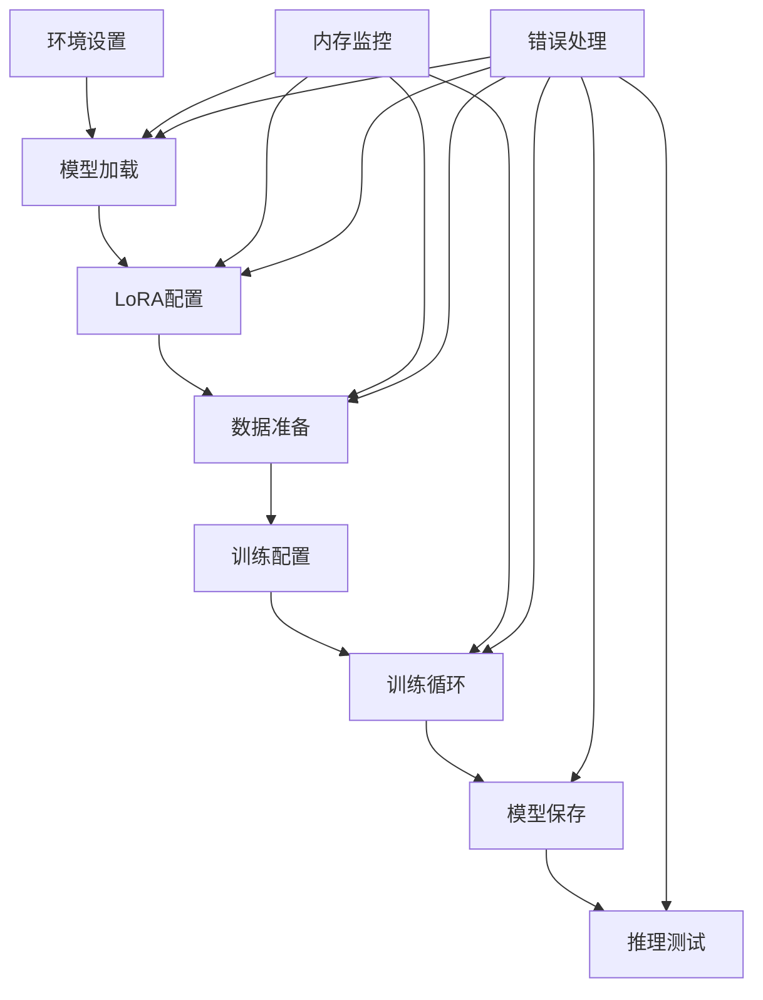

# 设计文档

## 概述

Qwen3优化微调系统被设计为一个内存高效、生产就绪的大语言模型微调解决方案。系统利用先进的优化技术，包括4位量化、LoRA适配器和梯度检查点，以在13GB或更少内存的消费级GPU上进行训练。架构强调模块化、错误处理和自动化资源管理。

## 架构

### 高级架构



### 系统组件

1. **环境管理器**: 处理基于uv的Python环境设置
2. **内存优化器**: 监控和管理GPU内存使用
3. **模型管理器**: 加载和配置带量化的模型
4. **LoRA适配器**: 配置参数高效微调
5. **数据管道**: 处理和分词训练数据
6. **训练引擎**: 协调训练过程
7. **推理测试器**: 验证训练后的模型
8. **日志记录器**: 提供全面的日志记录和监控

## 组件和接口

### 环境管理器
```python
class EnvironmentManager:
    def setup_uv_environment() -> bool
    def install_dependencies() -> bool
    def validate_environment() -> bool
    def get_python_executable() -> str
```

### 内存优化器
```python
class MemoryOptimizer:
    def monitor_gpu_memory() -> Tuple[float, float, float]
    def cleanup_gpu_memory() -> None
    def check_memory_safety(required_gb: float) -> bool
    def optimize_for_training() -> None
```

### 模型管理器
```python
class ModelManager:
    def load_model_with_quantization(model_name: str) -> Tuple[Model, Tokenizer]
    def configure_quantization() -> BitsAndBytesConfig
    def prepare_for_training(model: Model) -> Model
```

### LoRA适配器
```python
class LoRAAdapter:
    def create_lora_config() -> LoraConfig
    def apply_lora(model: Model) -> Model
    def get_trainable_params_info(model: Model) -> Dict[str, int]
```

### 数据管道
```python
class DataPipeline:
    def load_qa_data_from_files() -> List[Dict]
    def format_for_qwen(data: List[Dict]) -> Dataset
    def tokenize_dataset(dataset: Dataset, tokenizer: Tokenizer) -> Dataset
    def create_data_collator(tokenizer: Tokenizer) -> DataCollator
```

### 训练引擎
```python
class TrainingEngine:
    def create_training_args() -> TrainingArguments
    def create_trainer(model: Model, dataset: Dataset, args: TrainingArguments) -> Trainer
    def train_model(trainer: Trainer) -> Trainer
    def save_model(trainer: Trainer, output_dir: str) -> None
```

### 推理测试器
```python
class InferenceTester:
    def load_finetuned_model(model_path: str) -> Tuple[Model, Tokenizer]
    def test_inference(model: Model, tokenizer: Tokenizer, prompt: str) -> str
    def validate_model_quality(responses: List[str]) -> bool
```

## 数据模型

### 训练配置
```python
@dataclass
class TrainingConfig:
    model_name: str = "Qwen/Qwen3-4B-Thinking-2507"
    output_dir: str = "./qwen3-finetuned"
    max_memory_gb: float = 13.0
    batch_size: int = 4
    gradient_accumulation_steps: int = 16
    learning_rate: float = 5e-5
    num_epochs: int = 100
    max_sequence_length: int = 256
    lora_r: int = 6
    lora_alpha: int = 12
```

### 内存状态
```python
@dataclass
class MemoryStatus:
    allocated_gb: float
    cached_gb: float
    total_gb: float
    available_gb: float
    is_safe: bool
```

### 训练指标
```python
@dataclass
class TrainingMetrics:
    epoch: int
    step: int
    loss: float
    learning_rate: float
    memory_usage: MemoryStatus
    timestamp: datetime
```

## 错误处理

### 内存管理错误
- **OutOfMemoryError**: 自动清理和批次大小减少
- **InsufficientMemoryError**: 带优化建议的清晰错误消息
- **MemoryLeakError**: 主动清理和监控

### 模型加载错误
- **ModelNotFoundError**: 带模型名称建议的清晰错误
- **QuantizationError**: 回退到不同的量化设置
- **TokenizerError**: 自动分词器配置

### 训练错误
- **TrainingFailureError**: 检查点恢复和参数调整
- **DataLoadingError**: 优雅地回退到示例数据
- **SaveError**: 使用不同路径的多次保存尝试

### 错误恢复策略
1. **立即清理**: 清除GPU内存和临时文件
2. **参数调整**: 减少批次大小、序列长度或模型复杂度
3. **优雅降级**: 回退到更安全的配置
4. **用户指导**: 提供可操作的错误消息和建议

## 测试策略

### 单元测试
- **内存优化器测试**: 验证内存监控和清理
- **模型管理器测试**: 测试不同配置的模型加载
- **数据管道测试**: 验证数据加载和分词
- **LoRA适配器测试**: 验证LoRA配置和应用

### 集成测试
- **端到端训练**: 使用小数据集的完整训练管道
- **内存约束测试**: 在各种内存限制下的训练
- **错误恢复测试**: 模拟OOM条件并验证恢复
- **多GPU测试**: 验证在不同GPU配置上的行为

### 性能测试
- **内存使用基准**: 测量训练期间的峰值内存使用
- **训练速度测试**: 基准训练吞吐量
- **模型质量测试**: 验证微调模型性能
- **资源利用测试**: 监控CPU、GPU和磁盘使用

### 测试数据
- **合成QA数据**: 生成的问答对用于测试
- **真实数据集样本**: 来自实际数据集的小样本
- **边缘情况数据**: 格式错误、空或极长的序列
- **内存压力数据**: 用于测试内存限制的大数据集

### 持续集成
- **自动化测试**: 在不同GPU配置上运行测试
- **内存回归测试**: 确保内存使用不会增加
- **性能基准**: 跟踪训练速度和模型质量
- **兼容性测试**: 验证与不同PyTorch版本的兼容性