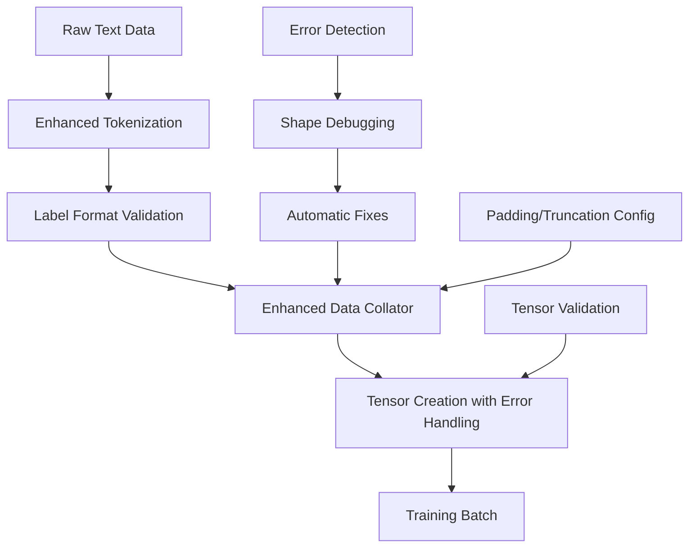

# Design Document

## Overview

The tensor creation fix addresses the critical issue where the training fails due to inconsistent tensor shapes in the data collator. The current implementation has problems with label formatting and padding/truncation settings that cause "Unable to create tensor" errors. This design implements proper tensor handling with consistent shapes and robust error handling.

## Architecture

### Current Problem Analysis

The error occurs because:
1. Labels are being created as nested lists instead of flat integer lists
2. The data collator is not properly handling padding and truncation
3. Inconsistent tensor shapes between input_ids and labels
4. Missing proper error handling for tensor creation failures

### Solution Architecture



## Components and Interfaces

### Enhanced Tokenization Function

```python
def enhanced_tokenize_function(examples, tokenizer, max_length):
    """Enhanced tokenization with proper label formatting"""
    # Tokenize with explicit padding and truncation
    tokenized = tokenizer(
        examples["text"],
        truncation=True,
        padding=False,  # Handle in data collator
        max_length=max_length,
        return_tensors=None,  # Return lists, not tensors
        add_special_tokens=True
    )
    
    # Create labels as flat integer lists (not nested)
    labels = []
    for input_ids in tokenized["input_ids"]:
        # Ensure labels are flat lists of integers
        if isinstance(input_ids, list):
            labels.append(input_ids.copy())
        else:
            labels.append(input_ids.tolist())
    
    tokenized["labels"] = labels
    
    # Validate tensor shapes
    _validate_tokenized_batch(tokenized)
    
    return tokenized

def _validate_tokenized_batch(tokenized):
    """Validate tokenized batch for consistent shapes"""
    input_ids = tokenized["input_ids"]
    labels = tokenized["labels"]
    
    # Check that all sequences are lists of integers
    for i, (inp, lab) in enumerate(zip(input_ids, labels)):
        if not isinstance(inp, list) or not isinstance(lab, list):
            raise ValueError(f"Sample {i}: input_ids and labels must be lists")
        
        if len(inp) != len(lab):
            raise ValueError(f"Sample {i}: input_ids length {len(inp)} != labels length {len(lab)}")
        
        # Check that all elements are integers
        if not all(isinstance(x, int) for x in inp):
            raise ValueError(f"Sample {i}: input_ids contains non-integer values")
        
        if not all(isinstance(x, int) for x in lab):
            raise ValueError(f"Sample {i}: labels contains non-integer values")
```

### Enhanced Data Collator

```python
class EnhancedDataCollatorForLanguageModeling:
    """Enhanced data collator with robust tensor creation"""
    
    def __init__(self, tokenizer, mlm=False, pad_to_multiple_of=None, return_tensors="pt"):
        self.tokenizer = tokenizer
        self.mlm = mlm
        self.pad_to_multiple_of = pad_to_multiple_of
        self.return_tensors = return_tensors
        
        # Ensure tokenizer has pad_token
        self._setup_pad_token()
    
    def _setup_pad_token(self):
        """Ensure tokenizer has a pad token"""
        if self.tokenizer.pad_token is None:
            if self.tokenizer.eos_token is not None:
                self.tokenizer.pad_token = self.tokenizer.eos_token
                logger.info(f"Set pad_token to eos_token: {self.tokenizer.eos_token}")
            else:
                # Add a new pad token
                self.tokenizer.add_special_tokens({'pad_token': '<|pad|>'})
                logger.info("Added new pad_token: <|pad|>")
    
    def __call__(self, features):
        """Process batch with enhanced error handling"""
        try:
            # Debug information
            logger.debug(f"Processing batch with {len(features)} samples")
            
            # Validate input features
            self._validate_features(features)
            
            # Extract and validate sequences
            input_ids = [f["input_ids"] for f in features]
            labels = [f["labels"] for f in features]
            
            # Log shape information for debugging
            self._log_shape_info(input_ids, labels)
            
            # Pad sequences to same length
            padded_inputs = self._pad_sequences(input_ids, self.tokenizer.pad_token_id)
            padded_labels = self._pad_sequences(labels, -100)  # -100 is ignore index
            
            # Create tensors
            batch = {
                "input_ids": torch.tensor(padded_inputs, dtype=torch.long),
                "labels": torch.tensor(padded_labels, dtype=torch.long)
            }
            
            # Add attention mask
            batch["attention_mask"] = (batch["input_ids"] != self.tokenizer.pad_token_id).long()
            
            # Final validation
            self._validate_batch_tensors(batch)
            
            logger.debug(f"Successfully created batch with shapes: {self._get_batch_shapes(batch)}")
            return batch
            
        except Exception as e:
            logger.error(f"Data collator error: {e}")
            self._provide_debugging_info(features, e)
            raise RuntimeError(f"Failed to create batch: {e}")
    
    def _validate_features(self, features):
        """Validate input features"""
        if not features:
            raise ValueError("Empty features list")
        
        required_keys = ["input_ids", "labels"]
        for i, feature in enumerate(features):
            for key in required_keys:
                if key not in feature:
                    raise ValueError(f"Feature {i} missing required key: {key}")
                
                if not isinstance(feature[key], list):
                    raise ValueError(f"Feature {i}[{key}] must be a list, got {type(feature[key])}")
                
                if not feature[key]:
                    raise ValueError(f"Feature {i}[{key}] is empty")
    
    def _pad_sequences(self, sequences, pad_value):
        """Pad sequences to same length"""
        if not sequences:
            return []
        
        max_length = max(len(seq) for seq in sequences)
        
        # Apply pad_to_multiple_of if specified
        if self.pad_to_multiple_of is not None:
            max_length = ((max_length + self.pad_to_multiple_of - 1) 
                         // self.pad_to_multiple_of * self.pad_to_multiple_of)
        
        padded = []
        for seq in sequences:
            padded_seq = seq + [pad_value] * (max_length - len(seq))
            padded.append(padded_seq)
        
        return padded
    
    def _validate_batch_tensors(self, batch):
        """Validate final batch tensors"""
        input_ids = batch["input_ids"]
        labels = batch["labels"]
        attention_mask = batch["attention_mask"]
        
        # Check shapes match
        if input_ids.shape != labels.shape:
            raise ValueError(f"Shape mismatch: input_ids {input_ids.shape} != labels {labels.shape}")
        
        if input_ids.shape != attention_mask.shape:
            raise ValueError(f"Shape mismatch: input_ids {input_ids.shape} != attention_mask {attention_mask.shape}")
        
        # Check data types
        if input_ids.dtype != torch.long:
            raise ValueError(f"input_ids must be torch.long, got {input_ids.dtype}")
        
        if labels.dtype != torch.long:
            raise ValueError(f"labels must be torch.long, got {labels.dtype}")
    
    def _log_shape_info(self, input_ids, labels):
        """Log shape information for debugging"""
        if logger.isEnabledFor(logging.DEBUG):
            input_lengths = [len(seq) for seq in input_ids]
            label_lengths = [len(seq) for seq in labels]
            
            logger.debug(f"Input lengths: min={min(input_lengths)}, max={max(input_lengths)}, avg={sum(input_lengths)/len(input_lengths):.1f}")
            logger.debug(f"Label lengths: min={min(label_lengths)}, max={max(label_lengths)}, avg={sum(label_lengths)/len(label_lengths):.1f}")
    
    def _get_batch_shapes(self, batch):
        """Get batch tensor shapes for logging"""
        return {key: tensor.shape for key, tensor in batch.items()}
    
    def _provide_debugging_info(self, features, error):
        """Provide detailed debugging information"""
        logger.error("=== DATA COLLATOR DEBUG INFO ===")
        logger.error(f"Error: {error}")
        logger.error(f"Number of features: {len(features) if features else 0}")
        
        if features:
            # Sample feature analysis
            sample_feature = features[0]
            logger.error(f"Sample feature keys: {list(sample_feature.keys())}")
            
            if "input_ids" in sample_feature:
                input_ids = sample_feature["input_ids"]
                logger.error(f"Sample input_ids type: {type(input_ids)}")
                logger.error(f"Sample input_ids length: {len(input_ids) if hasattr(input_ids, '__len__') else 'N/A'}")
                logger.error(f"Sample input_ids first few: {input_ids[:5] if isinstance(input_ids, list) else 'Not a list'}")
            
            if "labels" in sample_feature:
                labels = sample_feature["labels"]
                logger.error(f"Sample labels type: {type(labels)}")
                logger.error(f"Sample labels length: {len(labels) if hasattr(labels, '__len__') else 'N/A'}")
                logger.error(f"Sample labels first few: {labels[:5] if isinstance(labels, list) else 'Not a list'}")
        
        logger.error("=== END DEBUG INFO ===")
```

### Error Recovery System

```python
class TensorCreationErrorHandler:
    """Handle tensor creation errors with automatic fixes"""
    
    def __init__(self, tokenizer, max_length):
        self.tokenizer = tokenizer
        self.max_length = max_length
    
    def fix_tokenized_data(self, tokenized_data):
        """Fix common issues in tokenized data"""
        fixed_data = {}
        
        for key, values in tokenized_data.items():
            if key in ["input_ids", "labels"]:
                fixed_values = []
                for value in values:
                    fixed_value = self._fix_sequence(value)
                    fixed_values.append(fixed_value)
                fixed_data[key] = fixed_values
            else:
                fixed_data[key] = values
        
        return fixed_data
    
    def _fix_sequence(self, sequence):
        """Fix individual sequence issues"""
        # Handle nested lists
        if isinstance(sequence, list) and len(sequence) > 0:
            if isinstance(sequence[0], list):
                # Flatten nested list
                sequence = [item for sublist in sequence for item in sublist]
        
        # Ensure all elements are integers
        sequence = [int(x) if isinstance(x, (int, float)) else x for x in sequence]
        
        # Remove non-integer elements
        sequence = [x for x in sequence if isinstance(x, int)]
        
        # Truncate if too long
        if len(sequence) > self.max_length:
            sequence = sequence[:self.max_length]
        
        # Ensure minimum length
        if len(sequence) < 1:
            sequence = [self.tokenizer.eos_token_id or 0]
        
        return sequence
```

## Data Models

### Enhanced Dataset Processing

```python
@dataclass
class TensorCreationConfig:
    """Configuration for tensor creation"""
    max_length: int = 256
    padding: bool = True
    truncation: bool = True
    pad_to_multiple_of: Optional[int] = 8
    return_tensors: str = "pt"
    validate_tensors: bool = True
    debug_mode: bool = False

@dataclass
class BatchValidationResult:
    """Result of batch validation"""
    is_valid: bool
    errors: List[str]
    warnings: List[str]
    shape_info: Dict[str, Any]
    suggestions: List[str]
```

## Error Handling

### Comprehensive Error Detection

1. **Shape Validation**: Check tensor shapes match expectations
2. **Type Validation**: Ensure proper data types (int, long)
3. **Content Validation**: Verify token IDs are valid
4. **Memory Validation**: Check tensor sizes are reasonable

### Automatic Error Recovery

```python
def create_safe_data_collator(tokenizer, config: TensorCreationConfig):
    """Create data collator with automatic error recovery"""
    
    base_collator = EnhancedDataCollatorForLanguageModeling(
        tokenizer=tokenizer,
        mlm=False,
        pad_to_multiple_of=config.pad_to_multiple_of,
        return_tensors=config.return_tensors
    )
    
    error_handler = TensorCreationErrorHandler(tokenizer, config.max_length)
    
    def safe_collator(features):
        try:
            return base_collator(features)
        except Exception as e:
            logger.warning(f"Data collator failed, attempting recovery: {e}")
            
            # Try to fix the features
            try:
                fixed_features = []
                for feature in features:
                    fixed_feature = error_handler.fix_tokenized_data(feature)
                    fixed_features.append(fixed_feature)
                
                return base_collator(fixed_features)
            except Exception as recovery_error:
                logger.error(f"Recovery failed: {recovery_error}")
                raise RuntimeError(f"Data collator failed even after recovery: {recovery_error}")
    
    return safe_collator
```

## Testing Strategy

### Unit Tests

1. **Tokenization Tests**: Verify proper label creation
2. **Data Collator Tests**: Test padding and tensor creation
3. **Error Handling Tests**: Test recovery mechanisms
4. **Shape Validation Tests**: Verify tensor shapes

### Integration Tests

1. **End-to-End Pipeline**: Test complete data processing
2. **Training Compatibility**: Verify with actual training loop
3. **Error Recovery**: Test automatic fixes work
4. **Memory Efficiency**: Verify no memory leaks

This design ensures robust tensor creation with proper error handling and automatic recovery mechanisms.