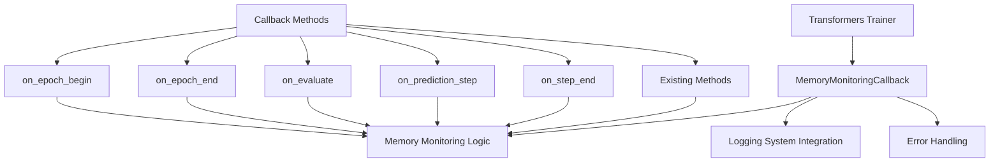

# Design Document

## Overview

The training callback fix addresses the compatibility issue between the custom `MemoryMonitoringCallback` class and the Hugging Face Transformers Trainer framework. The current implementation is missing several callback methods that the Trainer expects, causing training failures. This design implements a complete callback interface that maintains existing memory monitoring functionality while ensuring compatibility with the Transformers framework.

## Architecture

### Current Problem Analysis

The `MemoryMonitoringCallback` class currently implements:
- `on_init_end`
- `on_train_begin` 
- `on_step_begin`
- `on_log`
- `on_save`
- `on_train_end`

But the Transformers Trainer framework also expects:
- `on_epoch_begin`
- `on_epoch_end`
- `on_evaluate`
- `on_prediction_step`
- `on_step_end`

### Solution Architecture



## Components and Interfaces

### Enhanced MemoryMonitoringCallback

```python
class MemoryMonitoringCallback:
    """Enhanced memory monitoring callback with full Transformers compatibility"""
    
    def __init__(self, memory_optimizer: MemoryOptimizer, logging_system: Optional[LoggingSystem] = None):
        self.memory_optimizer = memory_optimizer
        self.logging_system = logging_system
        self.step_count = 0
        self.epoch_count = 0
        self.memory_history = []
        self.last_cleanup_step = 0
        self.epoch_start_memory = None
    
    # Existing methods (maintained as-is)
    def on_init_end(self, args, state, control, **kwargs): ...
    def on_train_begin(self, args, state, control, **kwargs): ...
    def on_step_begin(self, args, state, control, **kwargs): ...
    def on_log(self, args, state, control, logs=None, **kwargs): ...
    def on_save(self, args, state, control, **kwargs): ...
    def on_train_end(self, args, state, control, **kwargs): ...
    
    # New required methods
    def on_epoch_begin(self, args, state, control, **kwargs): ...
    def on_epoch_end(self, args, state, control, **kwargs): ...
    def on_step_end(self, args, state, control, **kwargs): ...
    def on_evaluate(self, args, state, control, **kwargs): ...
    def on_prediction_step(self, args, state, control, **kwargs): ...
    
    # Utility methods
    def _log_memory_status(self, event_name: str, step: int = None): ...
    def _handle_callback_error(self, method_name: str, error: Exception): ...
```

### Callback Method Responsibilities

#### on_epoch_begin
- Log memory status at epoch start
- Record epoch start memory for comparison
- Perform epoch-level memory optimization if needed
- Update epoch counter

#### on_epoch_end  
- Log memory status at epoch end
- Calculate memory usage delta for the epoch
- Perform cleanup if memory usage increased significantly
- Log epoch memory summary

#### on_step_end
- Complement existing on_step_begin functionality
- Log memory status after step completion
- Detect memory leaks by comparing step start/end memory
- Trigger cleanup if memory usage is concerning

#### on_evaluate
- Log memory status during evaluation
- Ensure memory is optimized for evaluation phase
- Handle evaluation-specific memory patterns

#### on_prediction_step
- Monitor memory during individual prediction steps
- Handle memory optimization for inference operations
- Log prediction-specific memory metrics

## Data Models

### Enhanced Memory Tracking

```python
@dataclass
class EpochMemoryMetrics:
    """Memory metrics for epoch-level tracking"""
    epoch: int
    start_memory_gb: float
    end_memory_gb: float
    peak_memory_gb: float
    memory_delta_gb: float
    cleanup_count: int
    timestamp_start: datetime
    timestamp_end: datetime

@dataclass
class CallbackMemoryEvent:
    """Memory event data for callback logging"""
    event_type: str  # 'epoch_begin', 'epoch_end', etc.
    step: int
    epoch: int
    memory_status: MemoryStatus
    timestamp: datetime
    additional_data: Dict[str, Any]
```

### Callback State Management

```python
class CallbackState:
    """State management for callback operations"""
    current_epoch: int = 0
    current_step: int = 0
    epoch_memory_history: List[EpochMemoryMetrics] = field(default_factory=list)
    callback_errors: List[Tuple[str, Exception, datetime]] = field(default_factory=list)
    last_cleanup_epoch: int = -1
    last_cleanup_step: int = -1
```

## Error Handling

### Graceful Callback Error Handling

1. **Method-Level Error Handling**: Each callback method wrapped in try-catch
2. **Error Logging**: All callback errors logged with context
3. **Training Continuation**: Errors don't stop training process
4. **Error Recovery**: Automatic recovery attempts for memory-related errors

### Error Recovery Strategies

```python
def _handle_callback_error(self, method_name: str, error: Exception):
    """Handle errors in callback methods gracefully"""
    error_msg = f"Error in {method_name}: {error}"
    logger.warning(error_msg)
    
    if self.logging_system:
        self.logging_system.warning(error_msg, "MEMORY_CALLBACK", {
            "method": method_name,
            "error_type": type(error).__name__,
            "step": self.step_count,
            "epoch": self.epoch_count
        })
    
    # Attempt memory cleanup on memory-related errors
    if "memory" in str(error).lower() or "cuda" in str(error).lower():
        try:
            self.memory_optimizer.cleanup_gpu_memory()
            logger.info(f"Emergency memory cleanup after {method_name} error")
        except Exception as cleanup_error:
            logger.error(f"Failed emergency cleanup: {cleanup_error}")
```

## Testing Strategy

### Unit Tests

1. **Callback Method Coverage**: Test all callback methods are callable
2. **Memory Monitoring**: Verify memory tracking in each callback
3. **Error Handling**: Test graceful error handling in callbacks
4. **State Management**: Verify proper state updates across callbacks

### Integration Tests

1. **Trainer Compatibility**: Test with actual Transformers Trainer
2. **Memory Optimization**: Verify memory cleanup triggers work
3. **Logging Integration**: Test logging system integration
4. **Error Recovery**: Test training continues after callback errors

### Mock Testing

```python
class MockTrainer:
    """Mock trainer for testing callback compatibility"""
    def __init__(self, callback):
        self.callback = callback
        self.state = MockTrainingState()
        self.args = MockTrainingArguments()
        self.control = MockTrainingControl()
    
    def test_all_callbacks(self):
        """Test all callback methods are callable"""
        callback_methods = [
            'on_init_end', 'on_train_begin', 'on_epoch_begin',
            'on_step_begin', 'on_step_end', 'on_log', 'on_evaluate',
            'on_prediction_step', 'on_save', 'on_epoch_end', 'on_train_end'
        ]
        
        for method_name in callback_methods:
            if hasattr(self.callback, method_name):
                method = getattr(self.callback, method_name)
                method(self.args, self.state, self.control)
```

This design ensures complete compatibility with the Transformers framework while maintaining all existing memory monitoring functionality and adding robust error handling.