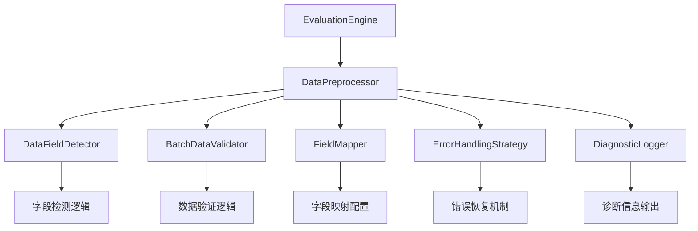

# 评估批次处理修复功能文档

## 概述

本文档描述了评估系统中批次数据处理问题的修复方案。该修复解决了原始系统中"批次数据为空"导致评估失败的问题，通过智能字段检测、数据验证、错误处理和降级机制，大大提高了数据处理的鲁棒性。

## 问题背景

原始评估系统在处理某些数据格式时会出现以下问题：

```
WARNING - 批次数据为空，任务: text_generation，批次键: ['input_ids', 'attention_mask', 'labels']
WARNING - 跳过空批次，索引: 0-4
WARNING - 没有有效的预测结果，返回默认指标
```

这些问题的根本原因是：
1. 硬编码的字段名称检测逻辑
2. 缺乏数据格式适配能力
3. 没有错误恢复机制
4. 缺少详细的诊断信息

## 解决方案架构

### 核心组件

1. **DataFieldDetector**: 智能字段检测器
2. **BatchDataValidator**: 批次数据验证器
3. **FieldMapper**: 可配置字段映射器
4. **ErrorHandlingStrategy**: 错误处理策略
5. **DataPreprocessor**: 统一数据预处理器
6. **DiagnosticLogger**: 诊断日志记录器

### 组件关系图



## 功能特性

### 1. 智能字段检测

- **多任务支持**: 支持文本生成、问答、分类、相似度等任务
- **字段优先级**: 根据任务类型自动确定字段优先级
- **置信度评分**: 为每个检测到的字段计算置信度分数
- **通用字段回退**: 当特定字段不可用时自动回退到通用字段

```python
from src.evaluation import DataFieldDetector

detector = DataFieldDetector()
result = detector.detect_input_fields(batch, "text_generation")
print(f"检测到的字段: {result.detected_fields}")
print(f"推荐字段: {result.recommended_field}")
print(f"置信度分数: {result.confidence_scores}")
```

### 2. 数据验证和质量检查

- **结构验证**: 检查数据类型和字段一致性
- **质量评估**: 统计有效样本比例和数据完整性
- **问题诊断**: 识别常见数据质量问题
- **改进建议**: 提供具体的数据处理建议

```python
from src.evaluation import BatchDataValidator

validator = BatchDataValidator(min_valid_ratio=0.1)
result = validator.validate_batch(batch)
print(f"验证结果: {'通过' if result.is_valid else '失败'}")
print(f"有效样本: {result.valid_samples_count}/{result.total_samples_count}")
print(f"问题: {result.issues}")
print(f"建议: {result.suggestions}")
```

### 3. 灵活的字段映射

- **任务特定映射**: 为不同任务定义专门的字段映射规则
- **自定义配置**: 支持用户自定义字段映射
- **组合输入**: 自动组合多个字段（如问答任务的问题+上下文）
- **映射回退**: 当主要字段不可用时自动尝试备选字段

```python
from src.evaluation import FieldMapper

# 自定义映射配置
custom_mapping = {
    "my_task": {
        "input_fields": ["custom_input", "data"],
        "target_fields": ["custom_target", "expected"]
    }
}

mapper = FieldMapper(mapping_config=custom_mapping)
best_field = mapper.find_best_input_field(batch, "my_task")
```

### 4. 错误处理和降级机制

- **多级降级**: 从特定字段到通用字段的多级降级
- **数据清洗**: 自动清理空白字符、过滤无效数据
- **类型转换**: 智能转换不同数据类型
- **默认值填充**: 为缺失数据提供合理的默认值

```python
from src.evaluation import ErrorHandlingStrategy

handler = ErrorHandlingStrategy(
    enable_fallback=True,
    enable_data_cleaning=True
)

# 处理各种错误情况
inputs = handler.handle_missing_fields(batch, "text_generation")
cleaned_inputs = handler.clean_data(inputs)
```

### 5. 诊断和监控

- **实时监控**: 实时记录批次处理统计信息
- **性能指标**: 监控处理延迟、吞吐量、内存使用
- **质量指标**: 跟踪数据质量和处理成功率
- **详细报告**: 生成综合的诊断报告

```python
from src.evaluation import DiagnosticLogger

logger = DiagnosticLogger(
    enable_detailed_logging=True,
    save_processing_report=True
)

# 生成综合报告
report = logger.generate_comprehensive_report()
logger.save_report_to_file(report)
```

## 使用方法

### 基本使用

```python
from src.evaluation import create_enhanced_evaluation_engine
from datasets import Dataset

# 创建增强的评估引擎
engine = create_enhanced_evaluation_engine()

# 创建数据集（即使字段名不标准也能处理）
dataset = Dataset.from_dict({
    "input_ids": [[1, 2, 3], [4, 5, 6]],
    "attention_mask": [[1, 1, 1], [1, 1, 1]],
    "labels": [[1, 2, 3], [4, 5, 6]]
})

# 诊断数据集问题
diagnosis = engine.diagnose_dataset(dataset, "text_generation")
print(f"诊断结果: {diagnosis['recommendations']}")

# 执行评估（会自动处理数据格式问题）
result = engine.evaluate_model_with_diagnostics(
    model, tokenizer, {"text_generation": dataset}, "my_model"
)
```

### 配置使用

```python
from src.evaluation import EvaluationConfig, load_evaluation_config

# 方法1: 直接创建配置
config = EvaluationConfig(
    data_processing={
        "field_mapping": {
            "text_generation": {
                "input_fields": ["text", "prompt", "input"],
                "target_fields": ["target", "answer"]
            }
        },
        "validation": {
            "min_valid_samples_ratio": 0.2,
            "enable_data_cleaning": True
        }
    }
)

# 方法2: 从文件加载配置
config = load_evaluation_config("config/my_config.yaml")

# 使用配置创建引擎
engine = create_enhanced_evaluation_engine(config_data=config.to_dict())
```

### 高级使用

```python
from src.evaluation import DataPreprocessor

# 创建数据预处理器
preprocessor = DataPreprocessor(config)

# 预处理批次数据
result = preprocessor.preprocess_batch(batch, "text_generation")

print(f"处理结果:")
print(f"  有效输入: {len(result.inputs)}")
print(f"  有效索引: {result.valid_indices}")
print(f"  跳过索引: {result.skipped_indices}")
print(f"  警告: {result.warnings}")

# 获取处理统计
stats = preprocessor.get_processing_statistics()
print(f"处理统计: {stats}")

# 生成诊断报告
report = preprocessor.generate_processing_report()
report_path = preprocessor.save_processing_report()
```

## 配置选项

### 字段映射配置

```yaml
field_mapping:
  text_generation:
    input_fields: ["text", "input", "prompt", "source"]
    target_fields: ["target", "answer", "output", "response"]
  
  question_answering:
    input_fields: ["question", "query", "q"]
    context_fields: ["context", "passage", "document"]
    target_fields: ["answer", "target", "a"]
  
  classification:
    input_fields: ["text", "input", "sentence"]
    target_fields: ["label", "target", "class", "category"]
```

### 验证配置

```yaml
validation:
  min_valid_samples_ratio: 0.1    # 最小有效样本比例
  skip_empty_batches: true        # 是否跳过空批次
  enable_data_cleaning: true      # 是否启用数据清洗
  enable_fallback: true           # 是否启用降级处理
```

### 诊断配置

```yaml
diagnostics:
  enable_detailed_logging: false  # 是否启用详细日志
  log_batch_statistics: true      # 是否记录批次统计
  save_processing_report: true    # 是否保存处理报告
```

## 性能优化

### 批次大小优化

```python
# 根据数据大小调整批次大小
if len(dataset) > 10000:
    batch_size = 100
elif len(dataset) > 1000:
    batch_size = 50
else:
    batch_size = 20

config = EvaluationConfig(batch_size=batch_size)
```

### 并发处理

```python
# 启用多线程处理
engine = create_enhanced_evaluation_engine()
engine.max_workers = 4  # 设置工作线程数

# 并发评估多个模型
results = engine.evaluate_multiple_models(models_info, datasets)
```

### 内存优化

```python
# 禁用详细日志以节省内存
config = EvaluationConfig(
    data_processing={
        "diagnostics": {
            "enable_detailed_logging": False,
            "log_batch_statistics": False
        }
    }
)

# 分批处理大数据集
for i in range(0, len(large_dataset), 1000):
    subset = large_dataset[i:i+1000]
    result = engine.evaluate_model(model, tokenizer, {"task": subset})
```

## 故障排除

### 常见问题和解决方案

#### 1. 批次数据为空

**问题**: 所有批次都被跳过，显示"批次数据为空"

**原因**: 数据字段名称不匹配预期格式

**解决方案**:
```python
# 诊断数据集
diagnosis = engine.diagnose_dataset(dataset, task_name)
print(f"可用字段: {diagnosis['batch_info']['available_fields']}")
print(f"建议: {diagnosis['recommendations']}")

# 配置自定义字段映射
custom_mapping = {
    task_name: {
        "input_fields": ["your_input_field"],
        "target_fields": ["your_target_field"]
    }
}
```

#### 2. 数据类型错误

**问题**: 字段包含非列表类型数据

**解决方案**:
```python
# 启用数据清洗和类型转换
config = EvaluationConfig(
    data_processing={
        "validation": {
            "enable_data_cleaning": True,
            "enable_fallback": True
        }
    }
)
```

#### 3. 有效样本比例过低

**问题**: 大量样本被标记为无效

**解决方案**:
```python
# 调整最小有效样本比例
config = EvaluationConfig(
    data_processing={
        "validation": {
            "min_valid_samples_ratio": 0.05  # 降低阈值
        }
    }
)

# 或者启用更强的数据清洗
config.data_processing["validation"]["enable_data_cleaning"] = True
```

#### 4. 处理速度慢

**问题**: 批次处理速度过慢

**解决方案**:
```python
# 禁用详细日志
config.data_processing["diagnostics"]["enable_detailed_logging"] = False

# 增加批次大小
config.batch_size = 64

# 启用并发处理
engine.max_workers = 4
```

### 调试技巧

#### 1. 启用详细日志

```python
import logging
logging.basicConfig(level=logging.DEBUG)

config = EvaluationConfig(
    data_processing={
        "diagnostics": {
            "enable_detailed_logging": True
        }
    }
)
```

#### 2. 使用诊断功能

```python
# 诊断单个批次
batch = dataset[:4]
diagnosis = preprocessor.diagnose_batch(batch, task_name)

# 查看详细的字段分析
field_analysis = diagnosis["field_detection_result"]["field_analysis"]
for field, analysis in field_analysis.items():
    print(f"{field}: {analysis}")
```

#### 3. 监控处理统计

```python
# 定期检查处理统计
stats = preprocessor.get_processing_statistics()
print(f"成功率: {stats['success_rate']:.2%}")
print(f"有效样本率: {stats['valid_sample_rate']:.2%}")

# 生成详细报告
report = preprocessor.generate_processing_report()
```

## 最佳实践

### 1. 数据准备

- 使用标准的字段名称（text, input, target, answer等）
- 确保数据类型一致（所有字段都是列表）
- 预先清理明显的无效数据
- 保持字段长度一致

### 2. 配置管理

- 为不同的数据集创建专门的配置文件
- 使用版本控制管理配置变更
- 定期验证配置文件的有效性
- 记录配置变更的原因和效果

### 3. 性能监控

- 定期检查处理统计信息
- 监控内存使用和处理速度
- 保存诊断报告用于问题分析
- 建立性能基准和告警机制

### 4. 错误处理

- 启用适当的降级处理机制
- 定期检查错误日志和警告信息
- 建立错误分类和处理流程
- 保持错误处理策略的更新

## 迁移指南

### 从旧版本迁移

```python
# 旧版本代码
from src.evaluation import EvaluationEngine
engine = EvaluationEngine(config)
result = engine.evaluate_model(model, tokenizer, datasets)

# 新版本代码（向后兼容）
from src.evaluation import create_enhanced_evaluation_engine
engine = create_enhanced_evaluation_engine()
result = engine.evaluate_model_with_diagnostics(model, tokenizer, datasets)

# 或者使用迁移工具
from src.evaluation import migrate_legacy_evaluation
result = migrate_legacy_evaluation(
    legacy_evaluation_func, model, tokenizer, datasets
)
```

### 配置迁移

```python
# 检查现有配置兼容性
from src.evaluation import validate_config_file
validation_result = validate_config_file("old_config.yaml")

if not validation_result["is_valid"]:
    print(f"配置问题: {validation_result['errors']}")
    print(f"建议: {validation_result['suggestions']}")

# 自动修复配置
from src.evaluation import ConfigValidator
validator = ConfigValidator()
fixed_config, fixes = validator.validate_and_fix_config(old_config)
print(f"应用的修复: {fixes}")
```

## 扩展开发

### 添加自定义字段检测器

```python
from src.evaluation import DataFieldDetector

class CustomFieldDetector(DataFieldDetector):
    def __init__(self):
        super().__init__()
        # 添加自定义字段优先级
        self.field_priorities["custom_task"] = {
            "input": ["custom_input", "data"],
            "target": ["custom_target", "expected"]
        }
```

### 添加自定义错误处理策略

```python
from src.evaluation import ErrorHandlingStrategy

class CustomErrorHandler(ErrorHandlingStrategy):
    def handle_custom_error(self, batch, error_type):
        # 实现自定义错误处理逻辑
        pass
```

### 添加自定义指标

```python
from src.evaluation import DiagnosticLogger

class CustomDiagnosticLogger(DiagnosticLogger):
    def log_custom_metrics(self, metrics):
        # 记录自定义指标
        pass
```

## 版本历史

- **v1.0.0**: 初始版本，包含基本的批次处理修复功能
- **v1.1.0**: 添加配置验证和自动修复功能
- **v1.2.0**: 增强诊断和监控功能
- **v1.3.0**: 添加性能优化和并发处理支持

## 支持和反馈

如果您在使用过程中遇到问题或有改进建议，请：

1. 查看本文档的故障排除部分
2. 检查诊断报告中的建议
3. 启用详细日志进行问题分析
4. 提交问题报告时包含诊断信息

## 参考资料

- [配置文件示例](../config/data_processing_config_example.yaml)
- [使用示例](../examples/evaluation_batch_processing_example.py)
- [API文档](api_reference.md)
- [性能测试报告](performance_test_results.md)